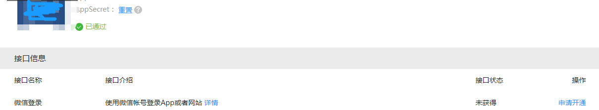
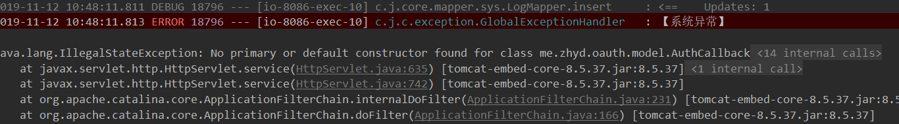

## 1.项目编译报错
 **问题描述** 

在使用JustAuth时，`AuthConfig.builder()`报错，提示没有`builder()`方法

 **解决方案：** 

安装完lombok插件即可

[eclipse安装lombok](https://www.zhyd.me/article/61)    

 **idea安装lombok：** file->settings->plugins->Browse Repositories->输入`lombok`，点击搜索->选中lombok点击install->安装完成后重启idea

 **进阶版问题：** 
idea中安装完lombok并重启idea之后，启动项目仍然报错：

 **解决办法** 

默认是eclipse  选择javac就可以了   
 

## 2.~~升级到1.8.0后如何启用state？~~

~~在原api使用方法的基础上，为config追加一个state即可。~~
```
AuthRequest authRequest = new AuthGiteeRequest(AuthConfig.builder()
        .clientId("clientId")
        .clientSecret("clientSecret")
        .redirectUri("redirectUri")
        .state("state") // 就是这儿
        .build());
```

## 3.~~升级到1.8.0后login方法报错？~~

~~这是因为1.8.0版本中新增了[AuthCallback](https://gitee.com/yadong.zhang/JustAuth/blob/master/src/main/java/me/zhyd/oauth/model/AuthCallback.java)类，这个类封装了所有可能的回调参数。目前包含以下三个参数：~~
- ~~`code`: 访问AuthorizeUrl后回调时带的参数code，用来换取token~~
- ~~`auth_code`: 支付宝授权登陆时不会返回code而是返回`auth_code`参数~~
- ~~`state`: 访问AuthorizeUrl后回调时带的参数state，用于和请求AuthorizeUrl前的state比较，防止CSRF攻击~~

~~1.8.0版本之后的api，可以直接用AuthCallback类作为回调方法的入参，比如：~~
```
@RequestMapping("/callback/{source}")
public Object login(@PathVariable("source") String source, AuthCallback callback) {
	System.out.println("进入callback：" + source + " callback params：" + JSONObject.toJSONString(callback));
	AuthRequest authRequest = getAuthRequest(source);
	AuthResponse response = authRequest.login(callback);
	System.out.println(JSONObject.toJSONString(response));
	return response;
}
```
 ~~_代码截取自_ ：https://github.com/justauth/JustAuth-demo~~

## 4.~~升级到1.8.0后对于state参数有什么特殊要求吗？~~

~~理论上没有，stata只是用来保持会话状态，因为http协议的无状态性，从授权到回调，无法感知具体是哪个用户触发的。所以可以使用state作为校验。注：state参数每次完整的授权链中只可用一次！（也是为了防止不必要的危险）~~

~~作者建议state命名格式如下：~~
- ~~授权登录：`{source}_{ip}_{random}`~~
- ~~账号绑定：`{source}_{userId}_{ip}_{random}`~~

~~其中`source`表示授权平台，可以直接去JustAuth中的source，`ip`为当前用户的ip（部分情况可能不适用），`random`为随机字符串，`userId`为当前登录用户的id。~~

~~注：`authorize`和`login`（不是指回调传回的`state`，而是声明`request`时传入的`state`）中传的`state`务必保证一致~~

## 5.升级到1.9.3+版本后编译失败

主要明显的就是`IpUtils.getIp`和request的`.state`报错。

这是因为从`v1.9.3`版本开始，对项目进行了一些优化，具体优化内容参考：[v1.9.3](https://gitee.com/yadong.zhang/JustAuth/releases/v1.9.3)和[v1.9.4](https://gitee.com/yadong.zhang/JustAuth/releases/v1.9.4)。

新版本的使用方式，参考[JustAuth-demo](https://github.com/justauth/JustAuth-demo/blob/master/src/main/java/me/zhyd/justauth/RestAuthController.java)
```
@RequestMapping("/render/{source}")
public void renderAuth(@PathVariable("source") String source, HttpServletResponse response) throws IOException {
	AuthRequest authRequest = getAuthRequest(source);
	String authorizeUrl = authRequest.authorize(AuthStateUtils.createState());
	response.sendRedirect(authorizeUrl);
}
@RequestMapping("/callback/{source}")
public Object login(@PathVariable("source") String source, AuthCallback callback) {
	AuthRequest authRequest = getAuthRequest(source);
	AuthResponse response = authRequest.login(callback);
	return response;
}
```

## 6.升级到最新版本后为什么支付宝登录不能用了？

在升级到新版后，使用支付宝登录会提示`ClassNotFoundExcption`异常，这是因为从`1.9.4`版本开始，JustAuth将不在强依赖`alipay-sdk-java`，如果你需要用到Alipay的授权登陆，那么你还需要添加以下依赖：

```
<dependency>
	<groupId>com.alipay.sdk</groupId>
	<artifactId>alipay-sdk-java</artifactId>
	<version>3.7.4.ALL</version>
</dependency>
```

## 7.“Scope参数错误或者Scope没有权限”是怎么回事？

微信开放平台授权登录提示“Scope参数错误或者Scope没有权限”


解决办法：请检查微信开放平台的应用是否有“微信登录”接口的权限。



“接口状态”必须为“已获得”！

## 8.微信登录时能在微信端提示登录成功吗？

不可以，这是**微信公众平台**的功能，截至到目前（JustAuth v1.12.0）为止，暂不支持**微信公众平台**的授权登录

## 9.微信登录时能不需要手机确认吗？扫码后就自动登录

不可以，微信开放平台不支持这种操作。可以把微信扫码登录理解成qq用账号密码登录，扫完码后不手动点确认，微信怎么知道用户是否同意了授权？    
当然，**微信公众平台**的授权流程可以越过这个限制，只要关注了公众号，后续扫码成功后就会自动登录，但是这是**微信公众平台**的功能，截至到目前（JustAuth v1.12.0）为止，暂不支持**微信公众平台**的授权登录

## 10.本地如何测那些*不支持本地地址回调*的授权登录？

推荐几种方案：
1. 改`hosts`，然后将测试程序的端口改为`80`
2. 使用`Nginx`/`Apache`做代理
3. FRP内网穿透，参考地址：[使用内网穿透的方式集成第三方登录](https://xkcoding.com/2019/05/22/spring-boot-login-with-oauth.html)

## 11.如何获取QQ登录的`unionId`？

在AuthConfig中设备`unionId`为`true`

```java
AuthRequest authRequest = new AuthQqRequest(AuthConfig.builder()
        .clientId("clientId")
        .clientSecret("clientSecret")
        .redirectUri("redirectUri")
        .unionId(true)
        .build());
```
> 注：使用unionId要求开发者必须已在qq开放平台申请了获取unionId的权限，否则可能会发生错误！切记！参考链接：[unionid介绍](http://wiki.connect.qq.com/unionid%E4%BB%8B%E7%BB%8D)

## 12. `AuthCallback`报错？

在使用JustAuth 1.13.0时，遇到如下所示错误：


这是因为我没有做好代码审查和测试，所以才导致的问题。我检讨！深刻的检讨！

请遇到该问题的朋友及时升级到最新版本（`1.13.1`修复该问题）

ps: 我要去祭天了


