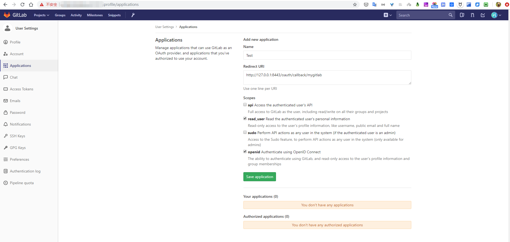
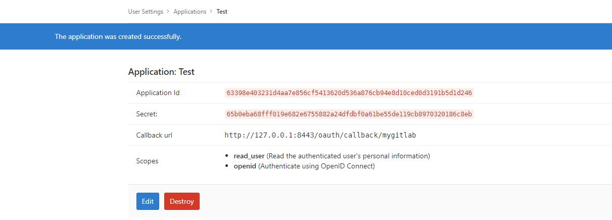
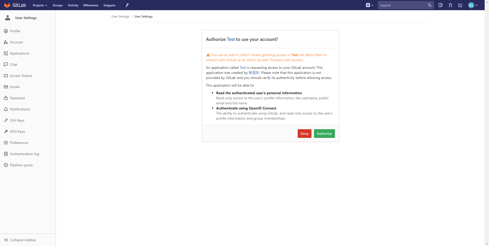
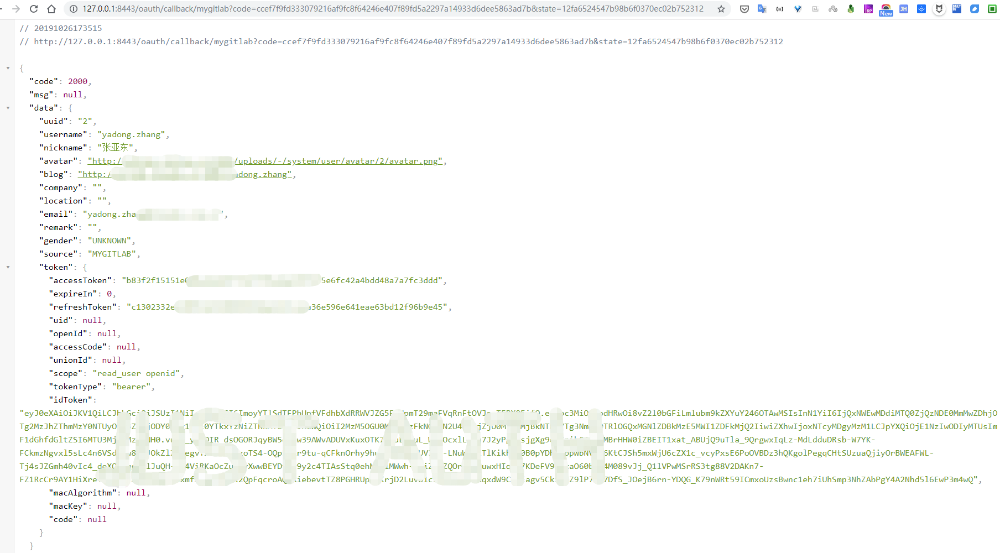

# 自定义第三方平台的OAuth

[JustAuth](https://github.com/justauth/JustAuth)发展到现在，基本上已经涵盖了国内外大多数知名的网站。[JustAuth](https://github.com/justauth/JustAuth)也一直以它的**全**和**简**，备受各位朋友的厚爱、支持。

但现在OAuth技术越来越成熟，越来越多的个人站长或者企业都开始搭建自己的OAuth授权平台，那么针对这种情况，[JustAuth](https://github.com/justauth/JustAuth)并不能做到面面俱到，无法去集成所有支持OAuth的网站（这也是不现实的）。

既然考虑到有这种需求，那么就要想办法解决，想办法填补漏洞，不为了自己，也为了陪伴[JustAuth](https://github.com/justauth/JustAuth)一路走来的所有朋友们。

[JustAuth](https://github.com/justauth/JustAuth)开发团队也在[v1.12.0](https://github.com/justauth/JustAuth/releases/tag/v1.12.0)版本中新加入了一大特性，就是可以支持任意支持OAuth的网站通过JustAuth实现便捷的OAuth登录！

下面我们会通过一个小例子，讲解如何使用JustAuth集成自己搭建的GitLab服务。

> 注：本节将会使用[JustAuth-demo](https://github.com/justauth/JustAuth-demo)Demo项目进行演示

## 搭建Gitlab服务

请自行解决，如果已有搭建好的Gitlab私服，请直接进入下面的步骤

## 创建应用




## 实现AuthSource接口

`AuthSource.java`是为了提供OAuth平台的API地址的统一接口，提供以下方法供实现：
- `AuthSource#authorize()`: 获取授权url. 必须实现
- `AuthSource#accessToken()`: 获取accessToken的url. 必须实现
- `AuthSource#userInfo()`: 获取用户信息的url. 必须实现
- `AuthSource#revoke()`: 获取取消授权的url. 非必须实现接口（部分平台不支持）
- `AuthSource#refresh()`: 获取刷新授权的url. 非必须实现接口（部分平台不支持）

**注：**
- 当通过JustAuth扩展实现第三方授权时，请参考`AuthDefaultSource`自行创建对应的枚举类并实现`AuthSource`接口
- 如果不是使用的枚举类，那么在授权成功后获取用户信息时，需要**单独处理source字段**的赋值
- 如果扩展了对应枚举类时，在`me.zhyd.oauth.request.AuthRequest#login(AuthCallback)`中可以通过`xx.toString()`获取对应的source

```java
package me.zhyd.justauth;

import me.zhyd.oauth.config.AuthSource;

/**
 * @author yadong.zhang (yadong.zhang0415(a)gmail.com)
 * @version 1.0
 * @website https://www.zhyd.me
 * @date 2019/10/26 16:54
 * @since 1.8
 */
public enum AuthCustomSource implements AuthSource {

    /**
     * 自己搭建的gitlab私服
     */
    MYGITLAB {
        /**
         * 授权的api
         *
         * @return url
         */
        @Override
        public String authorize() {
            return "http://gitlab.xxx.com/oauth/authorize";
        }

        /**
         * 获取accessToken的api
         *
         * @return url
         */
        @Override
        public String accessToken() {
            return "http://gitlab.xxx.com/oauth/token";
        }

        /**
         * 获取用户信息的api
         *
         * @return url
         */
        @Override
        public String userInfo() {
            return "http://gitlab.xxx.com/api/v4/user";
        }
    }
}
```

## 创建自定义的Request

```java
package me.zhyd.justauth;

import cn.hutool.http.HttpResponse;
import com.alibaba.fastjson.JSONObject;
import me.zhyd.oauth.cache.AuthStateCache;
import me.zhyd.oauth.config.AuthConfig;
import me.zhyd.oauth.enums.AuthUserGender;
import me.zhyd.oauth.exception.AuthException;
import me.zhyd.oauth.model.AuthCallback;
import me.zhyd.oauth.model.AuthToken;
import me.zhyd.oauth.model.AuthUser;
import me.zhyd.oauth.request.AuthDefaultRequest;
import me.zhyd.oauth.utils.UrlBuilder;

/**
 * @author yadong.zhang (yadong.zhang0415(a)gmail.com)
 * @version 1.0
 * @website https://www.zhyd.me
 * @date 2019/10/26 17:00
 * @since 1.8
 */
public class AuthMyGitlabRequest extends AuthDefaultRequest {


    public AuthMyGitlabRequest(AuthConfig config) {
        super(config, AuthCustomSource.MYGITLAB);
    }

    public AuthMyGitlabRequest(AuthConfig config, AuthStateCache authStateCache) {
        super(config, AuthCustomSource.MYGITLAB, authStateCache);
    }

    @Override
    protected AuthToken getAccessToken(AuthCallback authCallback) {
        HttpResponse response = doPostAuthorizationCode(authCallback.getCode());
        JSONObject object = JSONObject.parseObject(response.body());

        this.checkResponse(object);

        return AuthToken.builder()
                .accessToken(object.getString("access_token"))
                .refreshToken(object.getString("refresh_token"))
                .idToken(object.getString("id_token"))
                .tokenType(object.getString("token_type"))
                .scope(object.getString("scope"))
                .build();
    }

    @Override
    protected AuthUser getUserInfo(AuthToken authToken) {
        HttpResponse response = doGetUserInfo(authToken);
        JSONObject object = JSONObject.parseObject(response.body());

        this.checkResponse(object);

        return AuthUser.builder()
                .uuid(object.getString("id"))
                .username(object.getString("username"))
                .nickname(object.getString("name"))
                .avatar(object.getString("avatar_url"))
                .blog(object.getString("web_url"))
                .company(object.getString("organization"))
                .location(object.getString("location"))
                .email(object.getString("email"))
                .remark(object.getString("bio"))
                .gender(AuthUserGender.UNKNOWN)
                .token(authToken)
                .source(source.toString())
                .build();
    }

    private void checkResponse(JSONObject object) {
        // oauth/token 验证异常
        if (object.containsKey("error")) {
            throw new AuthException(object.getString("error_description"));
        }
        // user 验证异常
        if (object.containsKey("message")) {
            throw new AuthException(object.getString("message"));
        }
    }

    /**
     * 返回带{@code state}参数的授权url，授权回调时会带上这个{@code state}
     *
     * @param state state 验证授权流程的参数，可以防止csrf
     * @return 返回授权地址
     * @since 1.11.0
     */
    @Override
    public String authorize(String state) {
        return UrlBuilder.fromBaseUrl(super.authorize(state))
                .queryParam("scope", "read_user+openid")
                .build();
    }
}
```

## 测试效果

创建`AuthMyGitlabRequest`
```java
AuthRequest authRequest = new AuthMyGitlabRequest(AuthConfig.builder()
    .clientId("63398e403231d4aa7e856cf5413620d536a876cb94e8d10ced0d3191b5d1d246")
    .clientSecret("65b0eba68fff019e682e6755882a24dfdbf0a61be55de119cb8970320186c8eb")
    .redirectUri("http://127.0.0.1:8443/oauth/callback/mygitlab")
    .build());
```

> 注：完整代码都在[JustAuth-demo](https://github.com/justauth/JustAuth-demo)Demo项目中，本节只讲解关键代码

登录后的效果为





