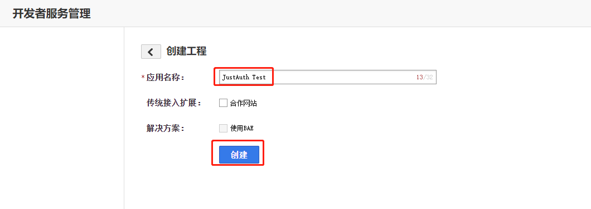
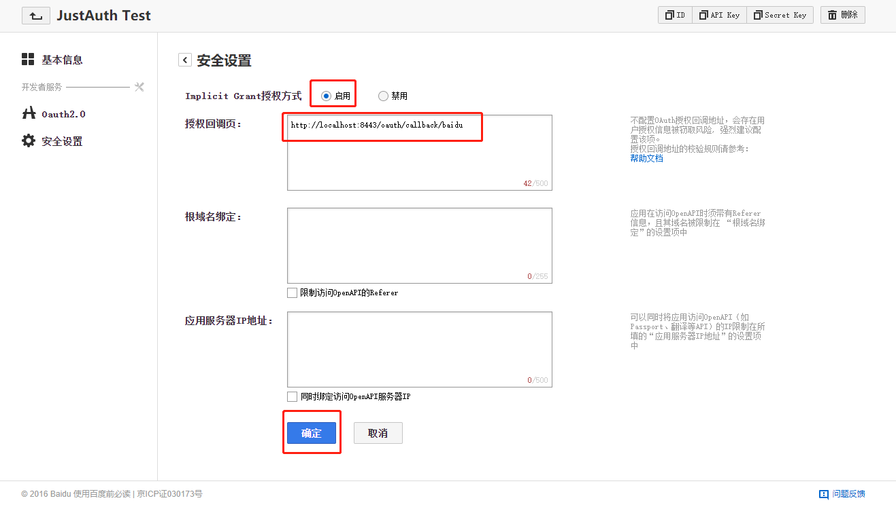
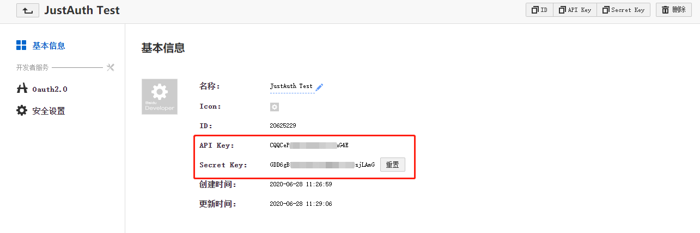
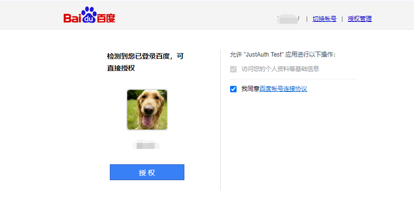

## 1. 申请应用

### 1.1 登录百度开发者中心

1. 注册百度开发者账号：[百度Passport](https://passport.baidu.com/v2/?reg&u=http%3A%2F%2Fdeveloper.baidu.com%2F&tpl=dev)。如果已有则忽略该步骤，直接进入第二步。
2. 登录百度开发者中心：[百度开发者中心](http://developer.baidu.com/)


### 1.2 创建第三方授权应用

1. 进入百度开发者控制台应用管理页面：[应用管理](http://developer.baidu.com/console#app/project)
2. 单击“创建工程”，开始创建应用。




记录以下三个信息：`API Key`、`Secret Key`和`应用回调地址`，后面我们会用到。

注： `API Key`、`Secret Key` 在“基本信息”页面



## 2. 集成JustAuth

### 2.1 引入依赖

```xml
<dependency>
  <groupId>me.zhyd.oauth</groupId>
  <artifactId>JustAuth</artifactId>
  <version>${latest.version}</version>
</dependency>
```

`${latest.version}`表示当前最新的版本，可以在[这儿](https://github.com/justauth/JustAuth/releases)获取最新的版本信息。

### 2.2 创建Request

```java
AuthRequest authRequest = new AuthBaiduRequest(AuthConfig.builder()
                .clientId("Client ID")
                .clientSecret("Client Secret")
                .redirectUri("应用回调地址")
                .build());
```

### 2.3 生成授权地址

我们可以直接使用以下方式生成第三方平台的授权链接：
```java
String authorizeUrl = authRequest.authorize(AuthStateUtils.createState());
```
这个链接我们可以直接后台重定向跳转，也可以返回到前端后，前端控制跳转。前端控制的好处就是，可以将第三方的授权页嵌入到iframe中，适配网站设计。


### 2.4 以上完整代码如下

```java
import me.zhyd.oauth.config.AuthConfig;
import me.zhyd.oauth.request.AuthBaiduRequest;
import me.zhyd.oauth.model.AuthCallback;
import me.zhyd.oauth.request.AuthRequest;
import me.zhyd.oauth.utils.AuthStateUtils;
import org.springframework.web.bind.annotation.PathVariable;
import org.springframework.web.bind.annotation.RequestMapping;
import org.springframework.web.bind.annotation.RestController;

import javax.servlet.http.HttpServletResponse;
import java.io.IOException;


@RestController
@RequestMapping("/oauth")
public class RestAuthController {

    @RequestMapping("/render")
    public void renderAuth(HttpServletResponse response) throws IOException {
        AuthRequest authRequest = getAuthRequest();
        response.sendRedirect(authRequest.authorize(AuthStateUtils.createState()));
    }

    @RequestMapping("/callback")
    public Object login(AuthCallback callback) {
        AuthRequest authRequest = getAuthRequest();
        return authRequest.login(callback);
    }

    private AuthRequest getAuthRequest() {
        return new AuthBaiduRequest(AuthConfig.builder()
                .clientId("API Key")
                .clientSecret("Secret Key")
                .redirectUri("应用回调地址")
                .build());
    }
}
```
授权链接访问成功后会看到以下页面内容：
   

点击“授权”即可完成百度的 OAuth 登录。

## 3. 授权结果

注：数据已脱敏

```json
{
    "code":2000,
    "data":{
        "avatar":"http://himg.bdimg.com/sys/portrait/item/1ea2e5878cxxxe4b8bf4882.jpg",
        "gender":"MALE",
        "nickname":"凌***丿",
        "rawUserInfo":{
            "birthday":"2009-04-05",
            "openid":"oD0ag_m52Xxxxxx6wWP2Dbm1X",
            "sex":"1",
            "is_realname":"1",
            "portrait":"1ea2e5878cxxx4b8bf4882",
            "is_bind_mobile":"1",
            "blood":"2",
            "username":"凌***丿"
        },
        "source":"BAIDU",
        "token":{
            "accessToken":"121.7f063a00b80xxxP8H6YxcJqD.C3r33w",
            "expireIn":2592000,
            "refreshToken":"122.b8cff99fe00cbxxxxZt-xSF906TGkEmPvdEn.IUdj0g",
            "scope":"basic"
        },
        "username":"凌***丿",
        "uuid":"oD0ag_m52xxxWP2Dbm1X"
    }
}
```

## 3. 推荐

官方推荐使用 [JustAuth-demo](https://github.com/justauth/JustAuth-demo) 示例项目进行测试。

使用步骤：
1. clone： [https://github.com/justauth/JustAuth-demo.git](https://github.com/justauth/JustAuth-demo.git)
2. 将上面申请的应用信息填入到`RestAuthController#getAuthRequest`方法的对应位置中：

3. 启动项目，访问 [http://localhost:8443](http://localhost:8443)
4. 选择对应的平台进行授权登录

5. 登录完成后，可以访问[http://localhost:8443/users](http://localhost:8443/users)查看已授权的用户


注：
1. JustAuth-demo 中的用户保存使用的本地 Map，所以重启项目后已登录的用户数据就会丢失
2. 如果直接使用 JustAuth-demo 项目进行测试，那么在配置测试应用的“回调地址”时要严格按照以下格式配置：`http://localhost:8443/oauth/callback/{平台名}`
3. 平台名参考 `JustAuthPlatformInfo` 枚举类 `names`


