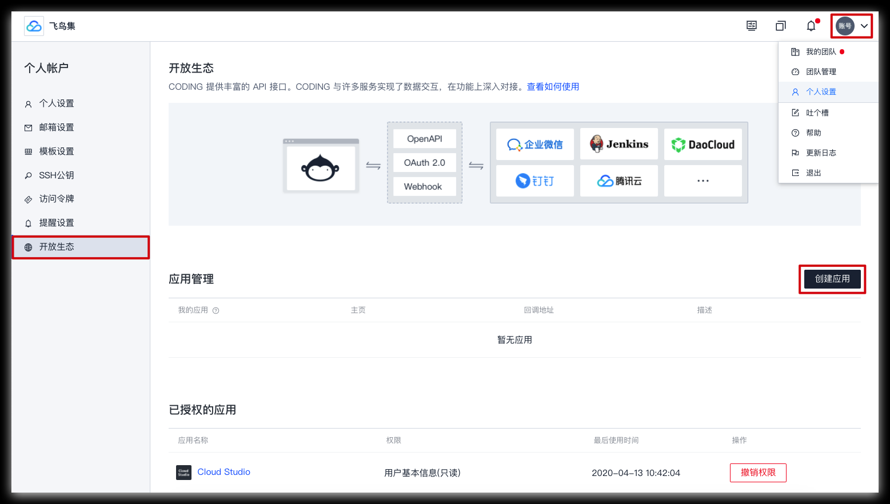
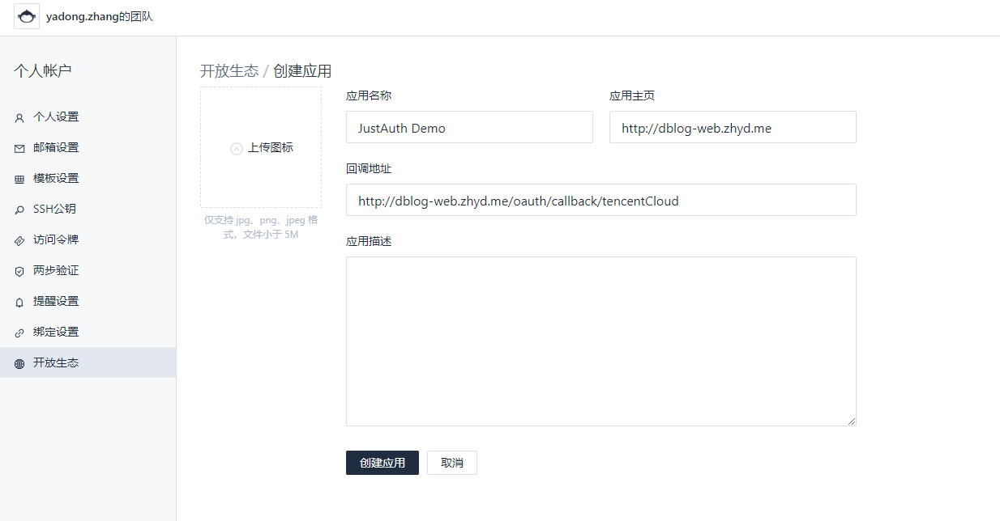
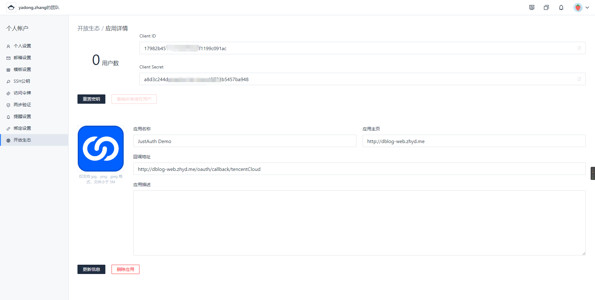
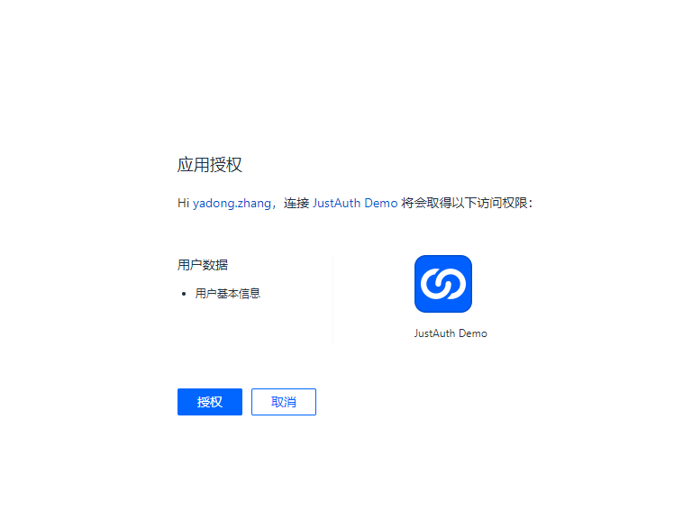

## 1. 申请应用

## 创建 CODING 应用
1. 点击【个人设置】->【开放生态】->【创建应用】，注册需要接入 CODING 的应用。



2. 在创建应用页面，填写接入的应用信息：

- 应用名称、应用主页及回调地址为必填项；
- 其中回调地址是用户授权后，CODING 回调到应用，并且回传授权码的地址；
- 如果没有上传图标将自动生成应用图标。

填写完毕后，点击【创建应用】。



注意：回调地址不支持 `127.0.0.1`、`localhost` 等配置

3. 应用创建完成后，在应用详情页，会生成 Client ID 和 Client Secret ，保存以便后续认证使用。



## 2. 集成JustAuth

### 2.1 引入依赖

```xml
<dependency>
  <groupId>me.zhyd.oauth</groupId>
  <artifactId>JustAuth</artifactId>
  <version>${latest.version}</version>
</dependency>
```

`${latest.version}`表示当前最新的版本，可以在[这儿](https://github.com/justauth/JustAuth/releases)获取最新的版本信息。

### 2.2 创建Request

```java
AuthRequest authRequest = new AuthTencentCloudRequest(AuthConfig.builder()
                .clientId("App Key")
                .clientSecret("App Secret")
                .redirectUri("授权回调页")
                .build());
```

### 2.3 生成授权地址

我们可以直接使用以下方式生成第三方平台的授权链接：
```java
String authorizeUrl = authRequest.authorize(AuthStateUtils.createState());
```
这个链接我们可以直接后台重定向跳转，也可以返回到前端后，前端控制跳转。前端控制的好处就是，可以将第三方的授权页嵌入到iframe中，适配网站设计。


### 2.4 以上完整代码如下

```java
import me.zhyd.oauth.config.AuthConfig;
import me.zhyd.oauth.request.AuthCodingRequest;
import me.zhyd.oauth.model.AuthCallback;
import me.zhyd.oauth.model.AuthToken;
import me.zhyd.oauth.request.AuthRequest;
import me.zhyd.oauth.utils.AuthStateUtils;
import org.springframework.web.bind.annotation.PathVariable;
import org.springframework.web.bind.annotation.RequestMapping;
import org.springframework.web.bind.annotation.RestController;

import javax.servlet.http.HttpServletResponse;
import java.io.IOException;


@RestController
@RequestMapping("/oauth")
public class RestAuthController {

    @RequestMapping("/render")
    public void renderAuth(HttpServletResponse response) throws IOException {
        AuthRequest authRequest = getAuthRequest();
        response.sendRedirect(authRequest.authorize(AuthStateUtils.createState()));
    }

    @RequestMapping("/callback")
    public Object login(AuthCallback callback) {
        AuthRequest authRequest = getAuthRequest();
        return authRequest.login(callback);
    }

    @RequestMapping("/revoke/{token}")
    public Object revokeAuth(@PathVariable("token") String token) throws IOException {
        AuthRequest authRequest = getAuthRequest();
        return authRequest.revoke(AuthToken.builder().accessToken(token).build());
    }

    private AuthRequest getAuthRequest() {
        return new AuthCodingRequest(AuthConfig.builder()
               .clientId("App Key")
               .clientSecret("App Secret")
               .redirectUri("授权回调页")
               // 比如以“ https://justauth.coding.net/ ”为例，codingGroupName = justauth
               .codingGroupName("团队名")
               .build());
    }
}
```
授权链接访问成功后会看到以下页面内容：



## 3. 授权结果

```json
{
    "code": 2000,
    "msg": null,
    "data": {
        "uuid": "xxx",
        "username": "yadong.zhang",
        "nickname": "yadong.zhang",
        "avatar": "https://coding.net/static/fruit_avatar/Fruit-6.png",
        "blog": "https://coding.net/u/HNMxPTOFRd",
        "company": "",
        "location": "",
        "email": null,
        "remark": "",
        "gender": "FEMALE",
        "source": "CODING",
        "token": {
            "accessToken": "xx",
            "expireIn": 858292,
            "refreshToken": "xx",
            "uid": null,
            "openId": null,
            "accessCode": null,
            "unionId": null,
            "scope": null,
            "tokenType": null,
            "idToken": null,
            "macAlgorithm": null,
            "macKey": null,
            "code": null,
            "oauthToken": null,
            "oauthTokenSecret": null,
            "userId": null,
            "screenName": null,
            "oauthCallbackConfirmed": null
        }
    }
}
```