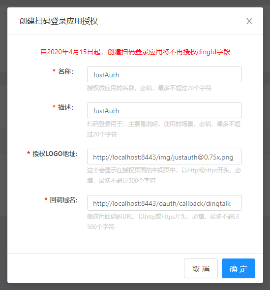
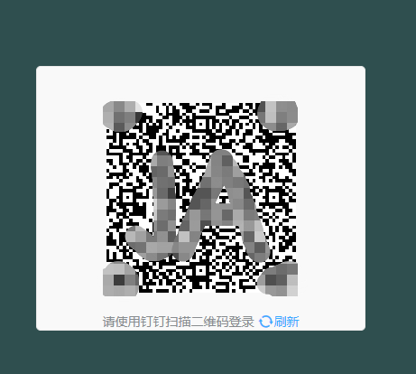

## 1. 申请应用

### 1.1 登录钉钉开发者中心

1. 登录钉钉开发者中心：[钉钉开发者中心](https://open-dev.dingtalk.com/)
2. 使用有管理员权限的钉钉账号扫码登录
    1. 如果仅做测试的话，可以点击右上角，选择“企业注册”，按照提示创建企业
    2. 创建完成后打开钉钉APP
    3. 选择工作台
    4. 点击左上角下拉框，选择刚刚创建的企业
    5. 点击右上角加号选择扫一扫，重新扫码登录
    6. 注：初次进入会被邀请填写一个问卷，如果是测试，则随便填就可


### 1.2 创建第三方授权应用

1. 在开发者管理控制台，选择“应用开发”
2. 点击左侧菜单的【移动接入应用-登录】
3. 然后点击右上角的【创建扫码登录应用授权】
4. 填写基本信息

5. 创建后即可看到 appId 和 appSecret。


记录以下三个信息：`appId`、`appSecret`和`回调域名`，后面我们会用到。


## 2. 集成JustAuth

### 2.1 引入依赖

```xml
<dependency>
  <groupId>me.zhyd.oauth</groupId>
  <artifactId>JustAuth</artifactId>
  <version>${latest.version}</version>
</dependency>
```

`${latest.version}`表示当前最新的版本，可以在[这儿](https://github.com/justauth/JustAuth/releases)获取最新的版本信息。

### 2.2 创建Request

```java
AuthRequest authRequest = new AuthDingTalkRequest(AuthConfig.builder()
                .clientId("Client ID")
                .clientSecret("Client Secret")
                .redirectUri("应用回调地址")
                .build());
```

### 2.3 生成授权地址

我们可以直接使用以下方式生成第三方平台的授权链接：
```java
String authorizeUrl = authRequest.authorize(AuthStateUtils.createState());
```
这个链接我们可以直接后台重定向跳转，也可以返回到前端后，前端控制跳转。前端控制的好处就是，可以将第三方的授权页嵌入到iframe中，适配网站设计。


### 2.4 以上完整代码如下

```java
import me.zhyd.oauth.config.AuthConfig;
import me.zhyd.oauth.request.AuthDingTalkRequest;
import me.zhyd.oauth.model.AuthCallback;
import me.zhyd.oauth.request.AuthRequest;
import me.zhyd.oauth.utils.AuthStateUtils;
import org.springframework.web.bind.annotation.PathVariable;
import org.springframework.web.bind.annotation.RequestMapping;
import org.springframework.web.bind.annotation.RestController;

import javax.servlet.http.HttpServletResponse;
import java.io.IOException;


@RestController
@RequestMapping("/oauth")
public class RestAuthController {

    @RequestMapping("/render")
    public void renderAuth(HttpServletResponse response) throws IOException {
        AuthRequest authRequest = getAuthRequest();
        response.sendRedirect(authRequest.authorize(AuthStateUtils.createState()));
    }

    @RequestMapping("/callback")
    public Object login(AuthCallback callback) {
        AuthRequest authRequest = getAuthRequest();
        return authRequest.login(callback);
    }

    private AuthRequest getAuthRequest() {
        return new AuthDingTalkRequest(AuthConfig.builder()
                .clientId("API Key")
                .clientSecret("Secret Key")
                .redirectUri("应用回调地址")
                .build());
    }
}
```
授权链接访问成功后会看到以下页面内容：
  

点击“授权”即可完成百度的 OAuth 登录。

## 3. 授权结果

注：数据已脱敏

```json
{
    "code":2000,
    "data":{
        "gender":"UNKNOWN",
        "nickname":"码上行动",
        "rawUserInfo":{
            "nick":"码上行动",
            "unionid":"4FiSzxIAgiEiE",
            "dingId":"$:LWCP_xYfqxZ3z99w==",
            "openid":"hHkfeC0xxfLr85zQiEiE",
            "main_org_auth_high_level":false
        },
        "source":"DINGTALK",
        "token":{
            "expireIn":0,
            "openId":"hHkfeC0XNixr85zQiEiE",
            "unionId":"4FiSzv7YnxIE5IAgiEiE"
        },
        "username":"码上行动",
        "uuid":"4FiSzv7YnxIE5IAgiEiE"
    }
}

```

## 3. 推荐

官方推荐使用 [JustAuth-demo](https://github.com/justauth/JustAuth-demo) 示例项目进行测试。

使用步骤：
1. clone： [https://github.com/justauth/JustAuth-demo.git](https://github.com/justauth/JustAuth-demo.git)
2. 将上面申请的应用信息填入到`RestAuthController#getAuthRequest`方法的对应位置中：

3. 启动项目，访问 [http://localhost:8443](http://localhost:8443)
4. 选择对应的平台进行授权登录

5. 登录完成后，可以访问[http://localhost:8443/users](http://localhost:8443/users)查看已授权的用户


注：
1. 如果直接使用 JustAuth-demo 项目进行测试，那么在配置测试应用的“回调地址”时要严格按照以下格式配置：`http://localhost:8443/oauth/callback/{平台名}`
2. 平台名参考 `JustAuthPlatformInfo` 枚举类 `names`


