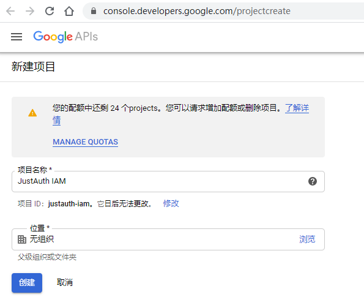
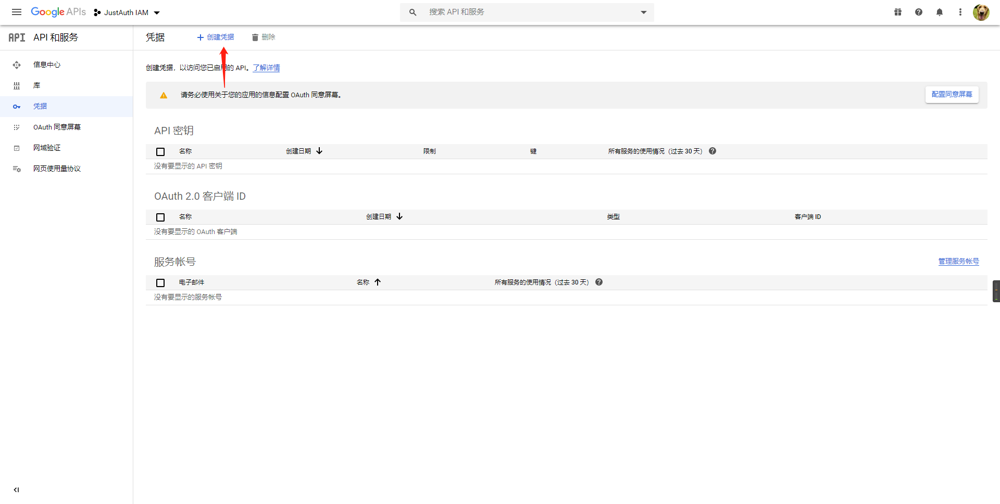
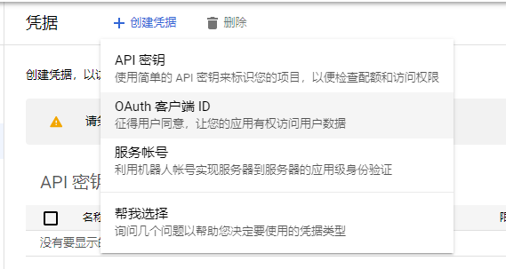
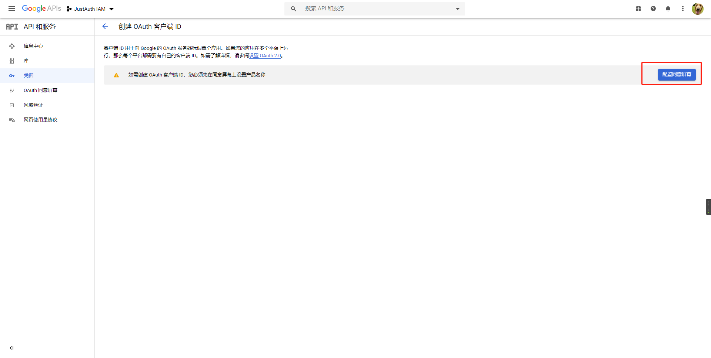
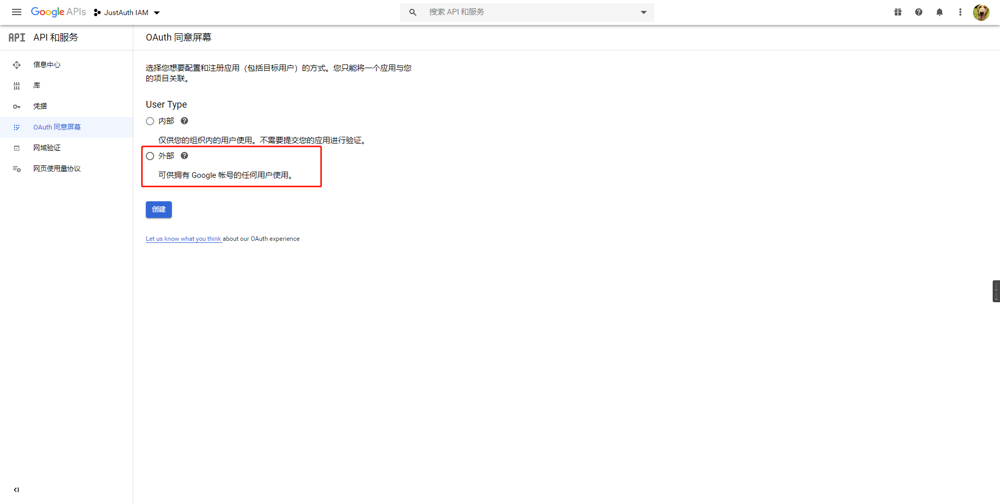
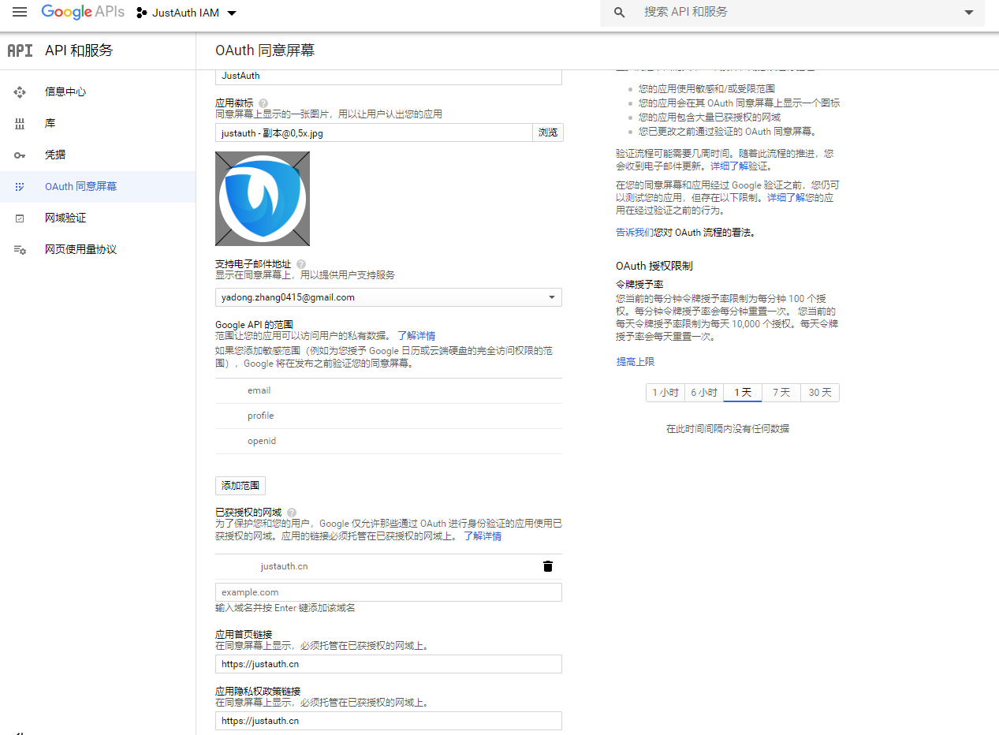
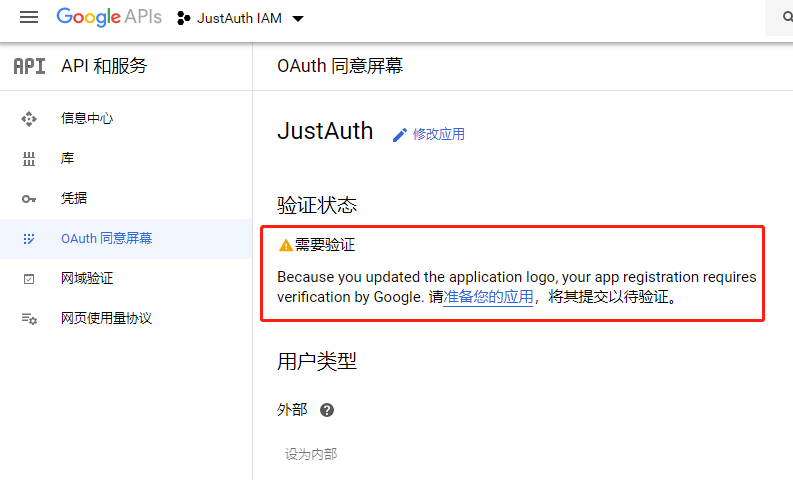
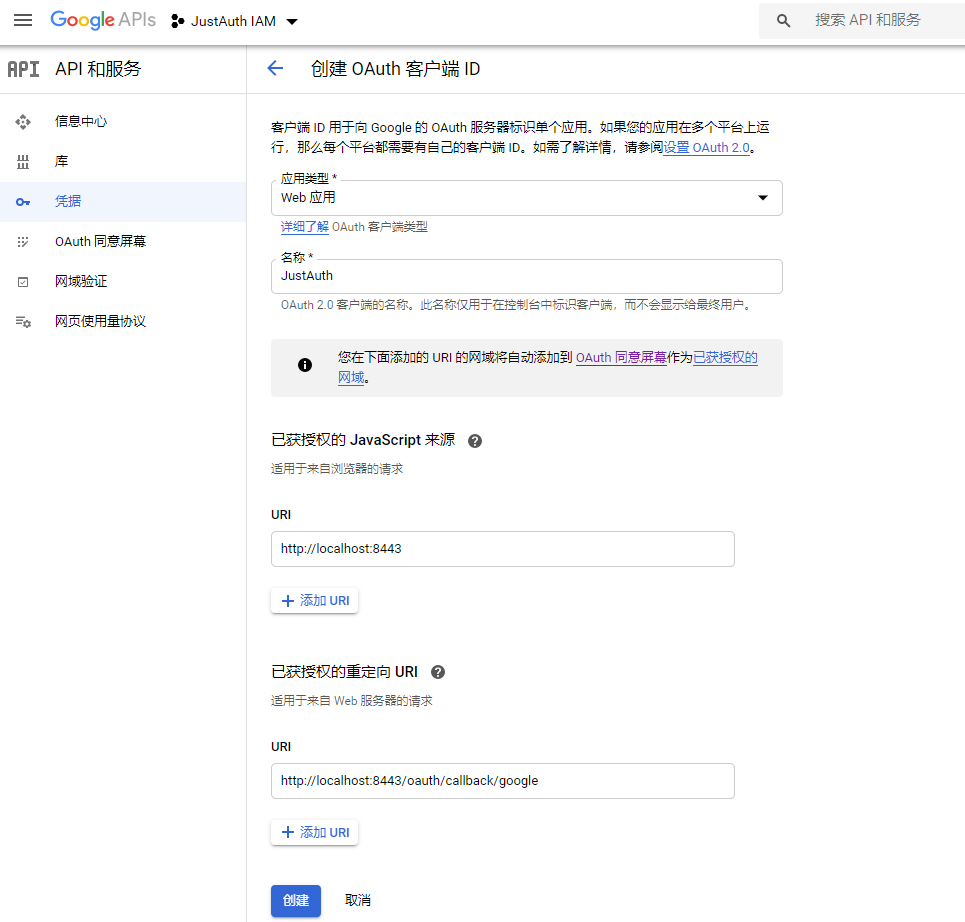
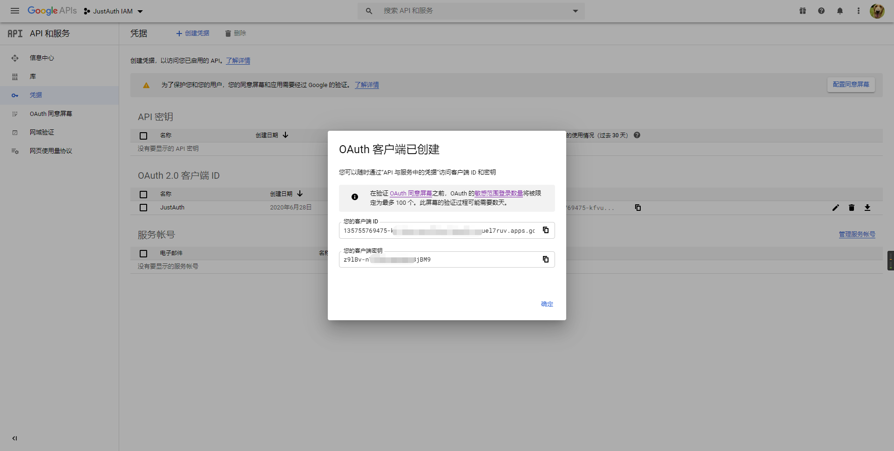
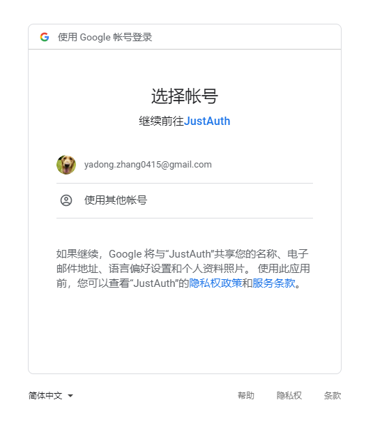

## 1. 申请应用

### 1.1 创建第三方授权应用

1. 登录 Google 开发者中心：[Google 开发者中心](https://console.developers.google.com/apis/dashboard)
2. 点击新建项目：[新建项目](https://console.developers.google.com/projectcreate)

3. 确保在第二步新建的项目下，选择“API 和服务”-“凭据”

4. 创建凭据

    1. 创建凭据时，选择 “OAuth 客户端 ID”    
    
    2. 首次创建凭据时系统会提示“如需创建 OAuth 客户端 ID，您必须先在同意屏幕上设置产品名称”，根据提示进行操作    
    
    3. 选择 “User Type”    
    
    这一步根据项目具体的用途进行选择，一般选择“外部”即可 
    4. 以上内容操作完成后，接下来就需要配置“OAuth 同意屏幕”的详情    
    
    5. 第四步保存后，会提示需要验证应用，如下 
      
    > 注：_如果仅作测试使用，则可以直接忽略这个验证操作，直接进入下一步，否则的话，建议按照提示进行验证。_  
    6. 这个时候我们直接再次访问 “凭据” - “创建凭据” - “OAuth 客户端 ID”，选择“Web 应用”，然后按照提示填入内容
    
    保存信息后，会弹出密钥和ID
    

记录以下三个信息：`Client ID`、`Client Secret`和`回调地址`，后面我们会用到。

**重要提示：“应用密钥”可保护你应用程序的安全，因此请确保其不会泄露！也不要与任何人共享你的“应用密钥”！！！**

## 2. 集成JustAuth

### 2.1 引入依赖

```xml
<dependency>
  <groupId>me.zhyd.oauth</groupId>
  <artifactId>JustAuth</artifactId>
  <version>${latest.version}</version>
</dependency>
```

`${latest.version}`表示当前最新的版本，可以在[这儿](https://github.com/justauth/JustAuth/releases)获取最新的版本信息。

### 2.2 创建Request

```java
AuthRequest authRequest = new AuthGoogleRequest(AuthConfig.builder()
                .clientId("Client ID")
                .clientSecret("Client Secret")
                .redirectUri("应用回调地址")
                // 针对国外平台配置代理
                .httpConfig(HttpConfig.builder()
                        .timeout(15000)
                        // host 和 port 请修改为开发环境的参数
                        .proxy(new Proxy(Proxy.Type.HTTP, new InetSocketAddress("127.0.0.1", 10080)))
                        .build())
                .build());
```

### 2.3 生成授权地址

我们可以直接使用以下方式生成第三方平台的授权链接：
```java
String authorizeUrl = authRequest.authorize(AuthStateUtils.createState());
```
这个链接我们可以直接后台重定向跳转，也可以返回到前端后，前端控制跳转。前端控制的好处就是，可以将第三方的授权页嵌入到iframe中，适配网站设计。


### 2.4 以上完整代码如下

```java
import me.zhyd.oauth.config.AuthConfig;
import me.zhyd.oauth.request.AuthGoogleRequest;
import me.zhyd.oauth.model.AuthCallback;
import me.zhyd.oauth.request.AuthRequest;
import me.zhyd.oauth.utils.AuthStateUtils;
import org.springframework.web.bind.annotation.PathVariable;
import org.springframework.web.bind.annotation.RequestMapping;
import org.springframework.web.bind.annotation.RestController;

import javax.servlet.http.HttpServletResponse;
import java.io.IOException;
import java.net.InetSocketAddress;
import java.net.Proxy;


@RestController
@RequestMapping("/oauth")
public class RestAuthController {

    @RequestMapping("/render")
    public void renderAuth(HttpServletResponse response) throws IOException {
        AuthRequest authRequest = getAuthRequest();
        response.sendRedirect(authRequest.authorize(AuthStateUtils.createState()));
    }

    @RequestMapping("/callback")
    public Object login(AuthCallback callback) {
        AuthRequest authRequest = getAuthRequest();
        return authRequest.login(callback);
    }

    private AuthRequest getAuthRequest() {
        return new AuthGoogleRequest(AuthConfig.builder()
                .clientId("Client ID")
                .clientSecret("Client Secret")
                .redirectUri("回调地址")
                // 针对国外平台配置代理
                .httpConfig(HttpConfig.builder()
                        .timeout(15000)
                        // host 和 port 请修改为开发环境的参数
                        .proxy(new Proxy(Proxy.Type.HTTP, new InetSocketAddress("127.0.0.1", 10080)))
                        .build())
                .build());
    }
}
```
授权链接访问成功后会看到以下页面内容：


点击“连接”即可完成百度的 OAuth 登录。

## 3. 授权结果

注：数据已脱敏

```json
{
    "code":2000,
    "data":{
        "avatar":"https://lh3.googleusercontent.com/a-/AOh14GizW9_TgXF5rYQLXAmqJEdJybnnISagxAggbmDg",
        "email":"yadong.zhang0415@gmail.com",
        "gender":"UNKNOWN",
        "location":"zh-CN",
        "nickname":"HandsomeBoy丶",
        "rawUserInfo":{
            "sub":"11xxx9",
            "email_verified":true,
            "name":"HandsomeBoy丶",
            "given_name":"HandsomeBoy丶",
            "locale":"zh-CN",
            "picture":"https://lh3.googleusercontent.com/a-/AOh14GizW9_TgXF5rYQLXAmqJEdJybnnISagxAggbmDg",
            "email":"yadong.zhang0415@gmail.com"
        },
        "source":"GOOGLE",
        "token":{
            "accessToken":"",
            "expireIn":3599,
            "idToken":"",
            "scope":"https://www.googleapis.com/auth/userinfo.profile https://www.googleapis.com/auth/userinfo.email openid",
            "tokenType":"Bearer"
        },
        "username":"yadong.zhang0415@gmail.com",
        "uuid":"11xxx9"
    }
}
```

## 3. 推荐

官方推荐使用 [JustAuth-demo](https://github.com/justauth/JustAuth-demo) 示例项目进行测试。

使用步骤：
1. clone： [https://github.com/justauth/JustAuth-demo.git](https://github.com/justauth/JustAuth-demo.git)
2. 将上面申请的应用信息填入到`RestAuthController#getAuthRequest`方法的对应位置中：

3. 启动项目，访问 [http://localhost:8443](http://localhost:8443)
4. 选择对应的平台进行授权登录

5. 登录完成后，可以访问[http://localhost:8443/users](http://localhost:8443/users)查看已授权的用户


注：
1. 如果直接使用 JustAuth-demo 项目进行测试，那么在配置测试应用的“回调地址”时要严格按照以下格式配置：`http://localhost:8443/oauth/callback/{平台名}`
2. 平台名参考 `JustAuthPlatformInfo` 枚举类 `names`


