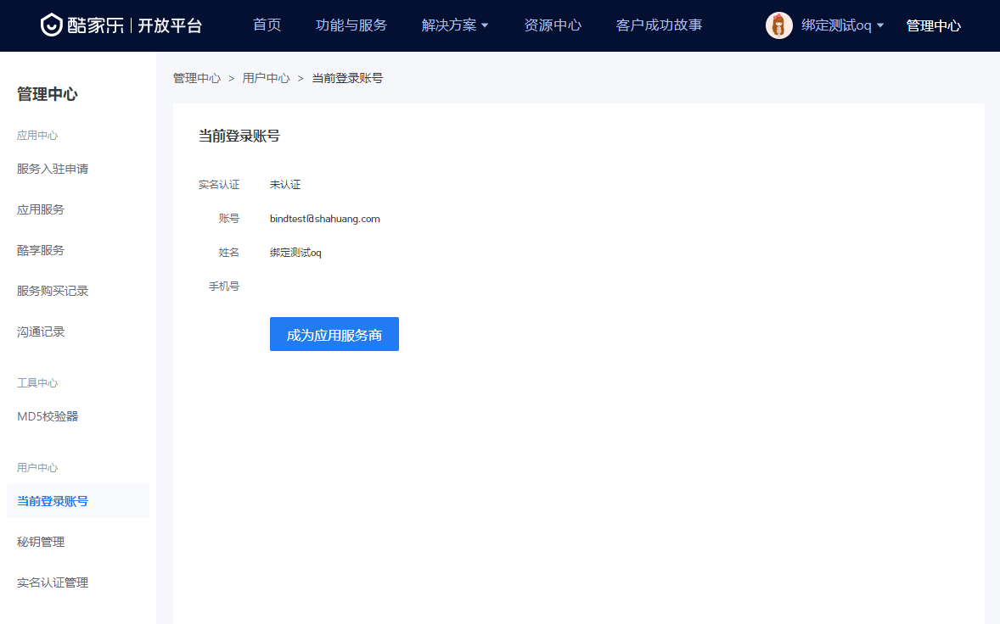
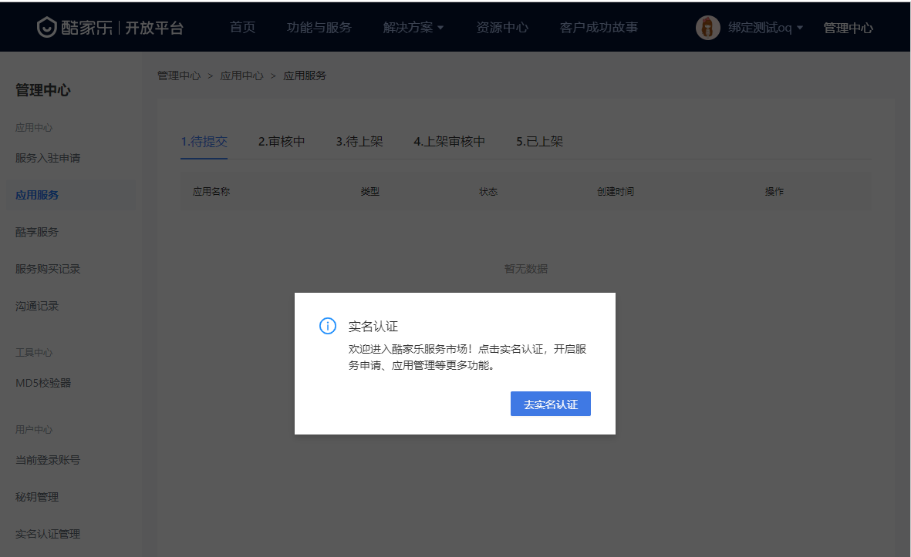
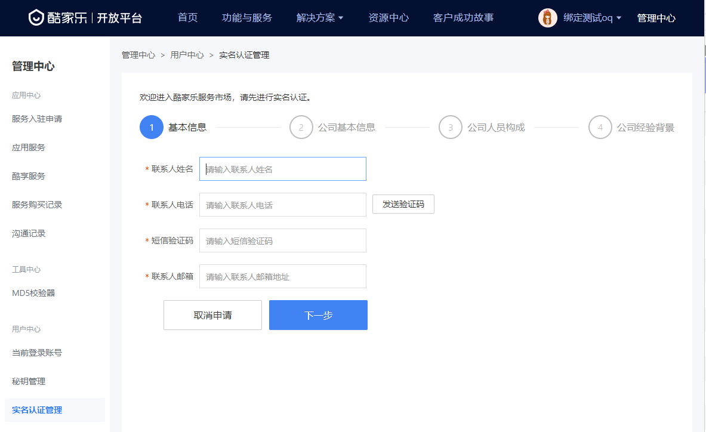
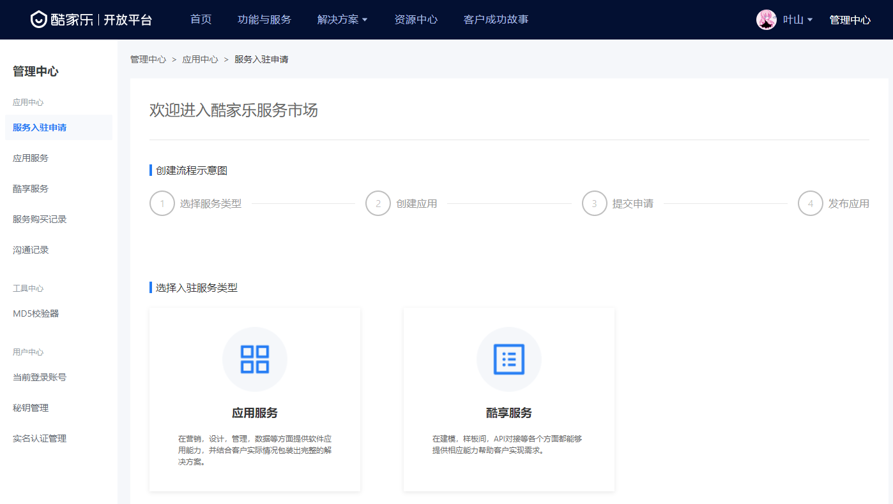
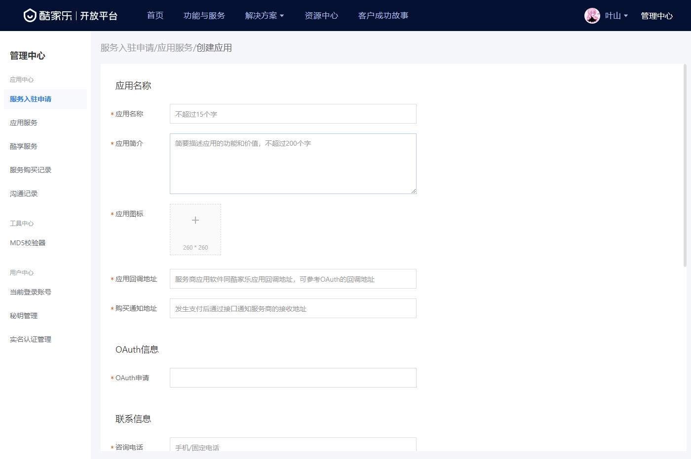
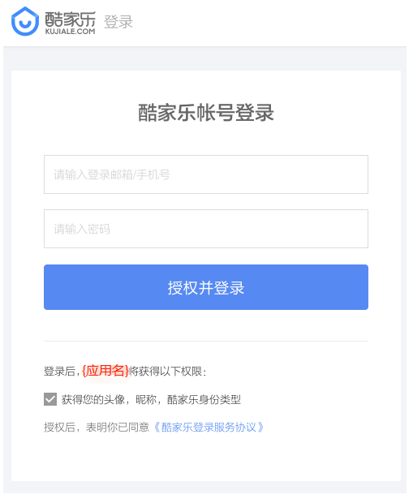

## 1. 申请应用
企业可通过两种途径申请应用，一、直接通过线下商务合作，由商务人员线下提供开通的对应应用的秘钥信息。二、线上自助申请（此步骤申请的应用可以在应用审核上线后出现在商家后台的应用市场内）。此步骤主要介绍线上自助申请的流程，若以获取到对应的秘钥信息，则直接进入步骤2.
注意：目前酷家乐的开放平台只针对合作企业开放，暂时不对个人开发者开放。商务合作或酷家乐应用市场相关信息可访问[https://www.kujiale.com/](酷家乐首页)通过首页上的在线客服咨询。
### 1.1 注册账号
注册酷家乐账号：[https://www.kujiale.com/](https://www.kujiale.com/)。如果已有则忽略该步骤，直接进入第二步。（一般建议直接使用企业账号）
### 1.2 认证开发者
进入酷家乐开放平台（[https://open.kujiale.com/](https://open.kujiale.com/)）点击右上角的管理中心进入第三方应用管理页面。

首次进入左侧菜单栏的-服务入驻申请模块，系统会要求进行开发者实名认证。

根据实名认证的流程，开发者需要依次提供：1.开发者信息，2.开发者企业信息，3.开发者企业人员构成信息，4.开发者企业经验背景信息

在2-3个工作日内，酷家乐运营同学会对提交信息进行审核，审核通过后可进入应用申请。
ps:如果有商务同学跟进的话可以联系商务同学提速，基本在1小时内能得到响应。
### 1.2 创建第三方授权应用
进入服务入驻申请模块（[https://open.kujiale.com/open/management/service-application](服务入驻申请)），申请应用服务。

选择服务类型以后提供相应的应用信息申请应用。

oauth2.0基础信息
- **应用名称** 一般填写自己的网站名称即可
- **应用简介** 填写应用描述，预期实现的功能场景。
- **应用回调地址** 重点，该地址为用户授权后需要跳转到的自己网站的地址，默认携带一个code参数
- **OAuth申请** 根据申请应用的具体业务场景而定，获取账号基本信息为其他权限（可申请用户授权资源项）申请的基础，即获取账号基本信息必选。若只是依托于酷家乐账号登录则只选择获取账号基本信息即可。
应用市场基础信息（当前只提供应用市场申请能力；应用市场的具体的营销规则，合作模式以及营销分成规则可通过在线客服与我们的商务同学取得联系。）
- **应用图标** 应用图标是应用展示在酷家乐应用市场内的图片表示，一般可以提供商家的品牌logo
- **购买通知地址** 当应用在应用市场内由其他商家付钱触发购买行为，酷家乐会通过此接口向第三方推送购买通知。
联系信息
- **咨询电话** 第三方需要为自己在酷家乐应用市场内的应用提供客户咨询能力。
- **客服链接** 第三方需要为自己在酷家乐应用市场内的应用提供客服支持。
- **开发者邮箱** 应用负责人联系邮箱，用于推送相关应用信息，例如：应用状态，应用服务情况，应用数据统计情况，以及相关的酷家乐接口迭代推送。
- **开发者电话** 应用负责人联系人电话，帮助在系统层面出现问题时候可以快速联系到负责人。
协议信息
- **应用协议名称** 应用的使用者需要知晓并且同意的协议名称。
- **应用协议内容** 应用的使用者需要知晓并且同意才可以使用购买该应用的协议内容。

保存并提交审核后，由运营在管理后台审核应用的相关信息以及应用申请相关权限的合理性。在审核通过后，可以在应用服务模块中查看到该应用，同时访问应用详情可以获取到此应用的秘钥信息（client_id：应用的唯一标识。client_secret：client_id对应的密钥，访问用户资源时用来验证应用的合法性。）

## 2. 集成JustAuth

### 2.1 引入依赖

```xml
<dependency>
  <groupId>me.zhyd.oauth</groupId>
  <artifactId>JustAuth</artifactId>
  <version>${latest.version}</version>
</dependency>
```

`${latest.version}`表示当前最新的版本，可以在[这儿](https://github.com/justauth/JustAuth/releases)获取最新的版本信息。

### 2.2 创建Request

```java
AuthRequest authRequest = new AuthKujialeRequest(AuthConfig.builder()
                .clientId("Client ID")
                .clientSecret("Client Secret")
                .redirectUri("应用回调地址")
                .build());
```

### 2.3 生成授权地址

我们可以直接使用以下方式生成第三方平台的授权链接：
```java
String authorizeUrl = authRequest.authorize(String state);
```
这个授权链接，默认的是`get_user_info`scope，即只想用户申请用户基本信息的授权，如果想自定义`scope`可以使用如下方式，单独传入对应的`scope`即可
```java
String authorizeUrl = authRequest.authorize(String state, String scopeStr);
```
这个链接我们可以直接后台重定向跳转，也可以返回到前端后，前端控制跳转。前端控制的好处就是，可以将第三方的授权页嵌入到iframe中，适配网站设计。

参数说明：
- state：用于防范CSRF攻击，各第三方可以视自己网站的安全性而定（建议预先了解一下oauth2.0的技术以及state参数的意义）
- scopeStr：酷家乐授权选项scope，以逗号隔开，具体资源可以参考每个[https://open.kujiale.com/open/apps?app_id=2](酷家乐开放接口文档)内的授权scope内容。

### 2.4 以上完整代码如下

```java
import me.zhyd.oauth.config.AuthConfig;
import me.zhyd.oauth.request.AuthKujialeRequest;
import me.zhyd.oauth.request.AuthRequest;
import org.springframework.web.bind.annotation.PathVariable;
import org.springframework.web.bind.annotation.RequestMapping;
import org.springframework.web.bind.annotation.RestController;

import javax.servlet.http.HttpServletResponse;
import java.io.IOException;


@RestController
@RequestMapping("/oauth")
public class RestAuthController {

    @RequestMapping("/render")
    public void renderAuth(HttpServletResponse response) throws IOException {
        AuthRequest authRequest = getAuthRequest();
        response.sendRedirect(authRequest.authorize("state"));
    }

    @RequestMapping("/callback")
    public Object login(String code, String state) {
        AuthRequest authRequest = getAuthRequest();
        //此处如果对安全性有要求，请校验state参数
        return authRequest.login(code);
    }

    private AuthRequest getAuthRequest() {
        return new AuthKujialeRequest(AuthConfig.builder()
                .clientId("Client ID")
                .clientSecret("Client Secret")
                .redirectUri("应用回调地址")
                .build());
    }
}
```
授权链接访问成功后会看到以下页面内容：


点击同意授权即可完成酷家乐的oauth登录。

## 3. 授权结果

注：数据已脱敏

```json
{
  "code": 2000,
  "msg": null,
  "data": {
    "uuid": "xxx",
    "username": "yadong.zhang",
    "nickname": "yadong.zhang",
    "avatar": "https://qhyxpicoss.kujiale.com/avatars/2017/03/03/origin8762512743744383438.jpg",
    "blog": null,
    "company": null,
    "location": null,
    "email": null,
    "remark": null,
    "gender": null,
    "source": "KUJIALE",
    "token": {
      "accessToken": "630740bxxxxxxxx4",
      "expireIn": 86400,
      "refreshToken": "1f2e0faedxxxxx537ec8",
      "uid": null,
      "openId": null,
      "accessCode": null,
      "unionId": null,
      "scope": null,
      "tokenType": null,
      "idToken": null,
      "macAlgorithm": null,
      "macKey": null,
      "code": null
    }
  }
}
```