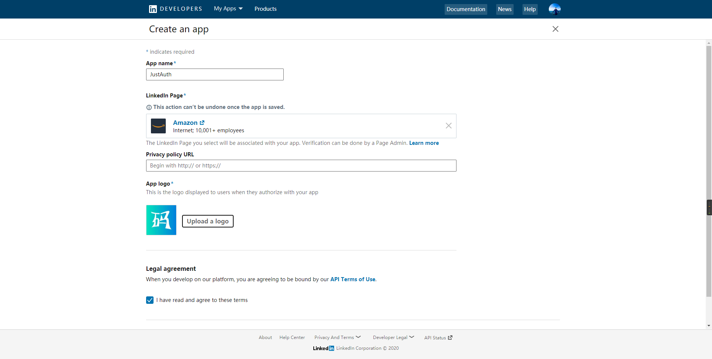
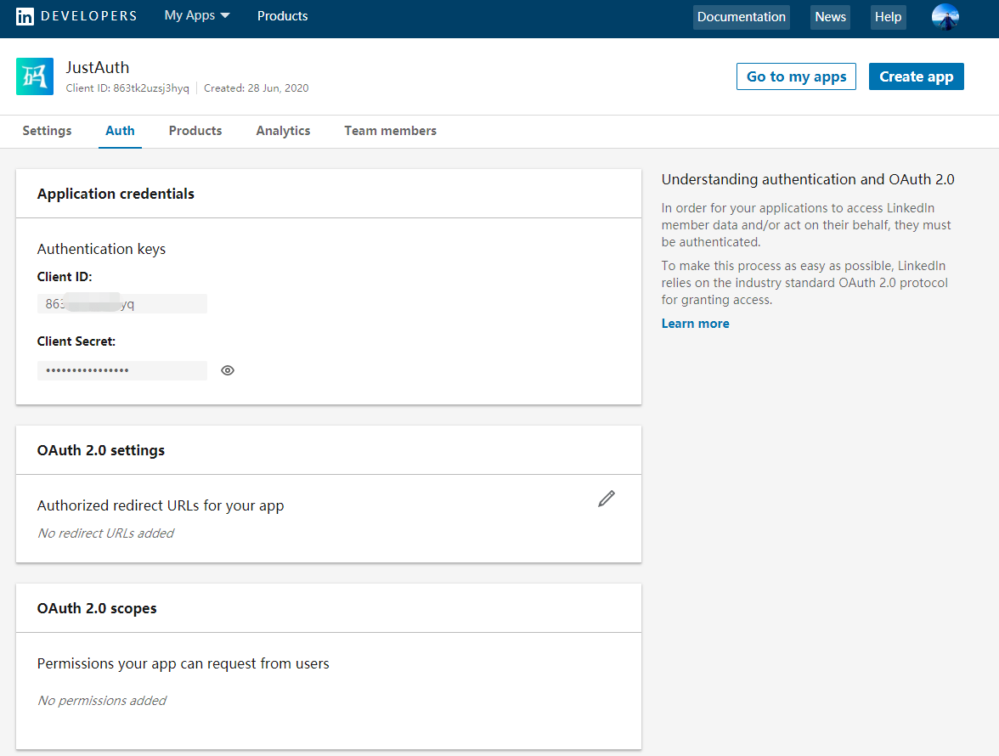
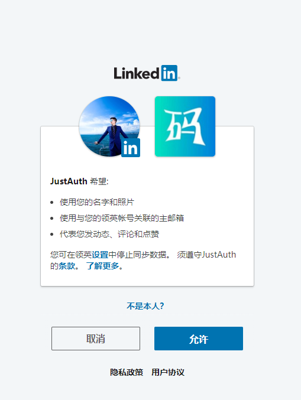

## 1. 申请应用

### 1.1 创建第三方授权应用

1. 登录领英开发者中心：[领英开发者中心](https://www.linkedin.com/developers/)
1. 点击“Create App”按钮创建应用
2. 填写基本信息。_注：本例为了演示，在选择公司时随便填了一个_

5. 创建后进入应用详情页面，选择“Auth”标签，进入 OAuth 配置页面

6. 配置回调地址


记录以下三个信息：`Client ID`、`Client Secret`和`回调地址`，后面我们会用到。

**重要提示：“应用密钥”可保护你应用程序的安全，因此请确保其不会泄露！也不要与任何人共享你的“应用密钥”！！！**

## 2. 集成JustAuth

### 2.1 引入依赖

```xml
<dependency>
  <groupId>me.zhyd.oauth</groupId>
  <artifactId>JustAuth</artifactId>
  <version>${latest.version}</version>
</dependency>
```

`${latest.version}`表示当前最新的版本，可以在[这儿](https://github.com/justauth/JustAuth/releases)获取最新的版本信息。

### 2.2 创建Request

```java
AuthRequest authRequest = new AuthLinkedinRequest(AuthConfig.builder()
                .clientId("Client ID")
                .clientSecret("Client Secret")
                .redirectUri("应用回调地址")
                .build());
```

### 2.3 生成授权地址

我们可以直接使用以下方式生成第三方平台的授权链接：
```java
String authorizeUrl = authRequest.authorize(AuthStateUtils.createState());
```
这个链接我们可以直接后台重定向跳转，也可以返回到前端后，前端控制跳转。前端控制的好处就是，可以将第三方的授权页嵌入到iframe中，适配网站设计。


### 2.4 以上完整代码如下

```java
import me.zhyd.oauth.config.AuthConfig;
import me.zhyd.oauth.request.AuthLinkedinRequest;
import me.zhyd.oauth.model.AuthCallback;
import me.zhyd.oauth.request.AuthRequest;
import me.zhyd.oauth.utils.AuthStateUtils;
import org.springframework.web.bind.annotation.PathVariable;
import org.springframework.web.bind.annotation.RequestMapping;
import org.springframework.web.bind.annotation.RestController;

import javax.servlet.http.HttpServletResponse;
import java.io.IOException;


@RestController
@RequestMapping("/oauth")
public class RestAuthController {

    @RequestMapping("/render")
    public void renderAuth(HttpServletResponse response) throws IOException {
        AuthRequest authRequest = getAuthRequest();
        response.sendRedirect(authRequest.authorize(AuthStateUtils.createState()));
    }

    @RequestMapping("/callback")
    public Object login(AuthCallback callback) {
        AuthRequest authRequest = getAuthRequest();
        return authRequest.login(callback);
    }

    private AuthRequest getAuthRequest() {
        return new AuthLinkedinRequest(AuthConfig.builder()
                .clientId("Client ID")
                .clientSecret("Client Secret")
                .redirectUri("回调地址")
                .build());
    }
}
```
授权链接访问成功后会看到以下页面内容：


点击“连接”即可完成百度的 OAuth 登录。

## 3. 授权结果

注：数据已脱敏

```json
{
    "code":2000,
    "data":{
        "avatar":"https://media.licdn.cn/dms/image/C4D03AQGurJNmXSZU3w/profixxxWUhmytAdd9zUI",
        "email":"yadong.zhang0415@gmail.com",
        "gender":"UNKNOWN",
        "nickname":"亚东 张",
        "rawUserInfo":{
            "firstName":{
                "localized":{
                    "zh_CN":"亚东"
                },
                "preferredLocale":{
                    "country":"CN",
                    "language":"zh"
                }
            },
            "lastName":{
                "localized":{
                    "zh_CN":"张"
                },
                "preferredLocale":{
                    "country":"CN",
                    "language":"zh"
                }
            },
            "profilePicture":{
                "displayImage":"urn:li:digitalmediaAsset:C4D03AQGxxxSZU3w",
                "displayImage~":{
                    "elements":[
                        {
                            "artifact":"",
                            "authorizationMethod":"PUBLIC",
                            "data":{
                                "com.linkedin.digitalmedia.mediaartifact.StillImage":{
                                    "storageSize":{
                                        "width":100,
                                        "height":100
                                    },
                                    "storageAspectRatio":{
                                        "widthAspect":1.0,
                                        "heightAspect":1.0,
                                        "formatted":"1.00:1.00"
                                    },
                                    "mediaType":"image/jpeg",
                                    "rawCodecSpec":{
                                        "name":"jpeg",
                                        "type":"image"
                                    },
                                    "displaySize":{
                                        "uom":"PX",
                                        "width":100.0,
                                        "height":100.0
                                    },
                                    "displayAspectRatio":{
                                        "widthAspect":1.0,
                                        "heightAspect":1.0,
                                        "formatted":"1.00:1.00"
                                    }
                                }
                            },
                            "identifiers":[
                                {
                                    "identifier":"",
                                    "file":"",
                                    "index":0,
                                    "mediaType":"image/jpeg",
                                    "identifierType":"EXTERNAL_URL",
                                    "identifierExpiresInSeconds":1599091200
                                }]
                        },
                        {
                            "artifact":"",
                            "authorizationMethod":"PUBLIC",
                            "data":{
                                "com.linkedin.digitalmedia.mediaartifact.StillImage":{
                                    "storageSize":{
                                        "width":200,
                                        "height":200
                                    },
                                    "storageAspectRatio":{
                                        "widthAspect":1.0,
                                        "heightAspect":1.0,
                                        "formatted":"1.00:1.00"
                                    },
                                    "mediaType":"image/jpeg",
                                    "rawCodecSpec":{
                                        "name":"jpeg",
                                        "type":"image"
                                    },
                                    "displaySize":{
                                        "uom":"PX",
                                        "width":200.0,
                                        "height":200.0
                                    },
                                    "displayAspectRatio":{
                                        "widthAspect":1.0,
                                        "heightAspect":1.0,
                                        "formatted":"1.00:1.00"
                                    }
                                }
                            },
                            "identifiers":[
                                {
                                    "identifier":"",
                                    "file":"",
                                    "index":0,
                                    "mediaType":"image/jpeg",
                                    "identifierType":"EXTERNAL_URL",
                                    "identifierExpiresInSeconds":1599091200
                                }]
                        },
                        {
                            "artifact":"",
                            "authorizationMethod":"PUBLIC",
                            "data":{
                                "com.linkedin.digitalmedia.mediaartifact.StillImage":{
                                    "storageSize":{
                                        "width":400,
                                        "height":400
                                    },
                                    "storageAspectRatio":{
                                        "widthAspect":1.0,
                                        "heightAspect":1.0,
                                        "formatted":"1.00:1.00"
                                    },
                                    "mediaType":"image/jpeg",
                                    "rawCodecSpec":{
                                        "name":"jpeg",
                                        "type":"image"
                                    },
                                    "displaySize":{
                                        "uom":"PX",
                                        "width":400.0,
                                        "height":400.0
                                    },
                                    "displayAspectRatio":{
                                        "widthAspect":1.0,
                                        "heightAspect":1.0,
                                        "formatted":"1.00:1.00"
                                    }
                                }
                            },
                            "identifiers":[
                                {
                                    "identifier":"",
                                    "file":"",
                                    "index":0,
                                    "mediaType":"image/jpeg",
                                    "identifierType":"EXTERNAL_URL",
                                    "identifierExpiresInSeconds":1599091200
                                }]
                        },
                        {
                            "artifact":,
                            "authorizationMethod":"PUBLIC",
                            "data":{
                                "com.linkedin.digitalmedia.mediaartifact.StillImage":{
                                    "storageSize":{
                                        "width":800,
                                        "height":800
                                    },
                                    "storageAspectRatio":{
                                        "widthAspect":1.0,
                                        "heightAspect":1.0,
                                        "formatted":"1.00:1.00"
                                    },
                                    "mediaType":"image/jpeg",
                                    "rawCodecSpec":{
                                        "name":"jpeg",
                                        "type":"image"
                                    },
                                    "displaySize":{
                                        "uom":"PX",
                                        "width":800.0,
                                        "height":800.0
                                    },
                                    "displayAspectRatio":{
                                        "widthAspect":1.0,
                                        "heightAspect":1.0,
                                        "formatted":"1.00:1.00"
                                    }
                                }
                            },
                            "identifiers":[
                                {
                                    "identifier":"",
                                    "file":,
                                    "index":0,
                                    "mediaType":"image/jpeg",
                                    "identifierType":"EXTERNAL_URL",
                                    "identifierExpiresInSeconds":1599091200
                                }]
                        }],
                    "paging":{
                        "count":10,
                        "start":0,
                        "links":[
                        ]
                    }
                }
            },
            "id":"r9xxX"
        },
        "source":"LINKEDIN",
        "token":{
            "accessToken":"xxx",
            "expireIn":5183999
        },
        "username":"亚东 张",
        "uuid":"r9xxxX"
    }
}
```

## 3. 推荐

官方推荐使用 [JustAuth-demo](https://github.com/justauth/JustAuth-demo) 示例项目进行测试。

使用步骤：
1. clone： [https://github.com/justauth/JustAuth-demo.git](https://github.com/justauth/JustAuth-demo.git)
2. 将上面申请的应用信息填入到`RestAuthController#getAuthRequest`方法的对应位置中：

3. 启动项目，访问 [http://localhost:8443](http://localhost:8443)
4. 选择对应的平台进行授权登录

5. 登录完成后，可以访问[http://localhost:8443/users](http://localhost:8443/users)查看已授权的用户


注：
1. 如果直接使用 JustAuth-demo 项目进行测试，那么在配置测试应用的“回调地址”时要严格按照以下格式配置：`http://localhost:8443/oauth/callback/{平台名}`
2. 平台名参考 `JustAuthPlatformInfo` 枚举类 `names`


