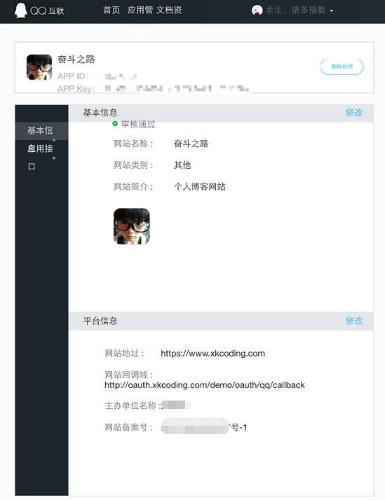

## 1. 申请应用

### 1.登录QQ互联平台
https://connect.qq.com/
### 2.申请开发者
进入“应用管理”页面：[https://connect.qq.com/manage.html#/](https://connect.qq.com/manage.html#/)
如果是第一次使用，并且未进行过开发者认证，需要提交一下个人资料，待认证通过后方可创建应用。

### 3. 添加应用

依次点击：应用管理 -> 网站应用 -> 创建应用，应用信息提交后，等待审核通过即可

应用审核通过后如下：



copy以下三个信息：`App ID`、`App Key`和`网站回调域`。

## 2. 集成JustAuth


### 2.1 引入依赖

```xml
<dependency>
  <groupId>me.zhyd.oauth</groupId>
  <artifactId>JustAuth</artifactId>
  <version>${latest.version}</version>
</dependency>
```

`${latest.version}`表示当前最新的版本，可以在[这儿](https://github.com/justauth/JustAuth/releases)获取最新的版本信息。

### 2.2 创建Request

```java
AuthRequest authRequest = new AuthQqRequest(AuthConfig.builder()
                .clientId("App ID")
                .clientSecret("App Key")
                .redirectUri("网站回调域")
                .build());
```

### 2.3 生成授权地址

我们可以直接使用以下方式生成第三方平台的授权链接：
```java
String authorizeUrl = authRequest.authorize(AuthStateUtils.createState());
```
这个链接我们可以直接后台重定向跳转，也可以返回到前端后，前端控制跳转。前端控制的好处就是，可以将第三方的授权页嵌入到iframe中，适配网站设计。


### 2.4 以上完整代码如下

```java
import me.zhyd.oauth.config.AuthConfig;
import me.zhyd.oauth.request.AuthQqRequest;
import me.zhyd.oauth.model.AuthCallback;
import me.zhyd.oauth.request.AuthRequest;
import me.zhyd.oauth.utils.AuthStateUtils;
import org.springframework.web.bind.annotation.PathVariable;
import org.springframework.web.bind.annotation.RequestMapping;
import org.springframework.web.bind.annotation.RestController;

import javax.servlet.http.HttpServletResponse;
import java.io.IOException;


@RestController
@RequestMapping("/oauth")
public class RestAuthController {

    @RequestMapping("/render")
    public void renderAuth(HttpServletResponse response) throws IOException {
        AuthRequest authRequest = getAuthRequest();
        response.sendRedirect(authRequest.authorize(AuthStateUtils.createState()));
    }

    @RequestMapping("/callback")
    public Object login(AuthCallback callback) {
        AuthRequest authRequest = getAuthRequest();
        return authRequest.login(callback);
    }

    private AuthRequest getAuthRequest() {
        return new AuthQqRequest(AuthConfig.builder()
                .clientId("App ID")
                .clientSecret("App Key")
                .redirectUri("网站回调域")
                .build());
    }
}
```

## 3. 授权结果

暂无