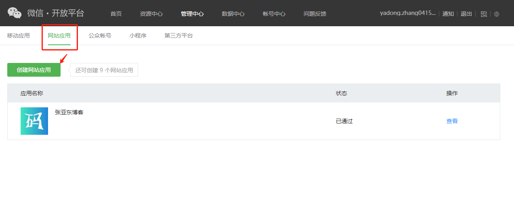
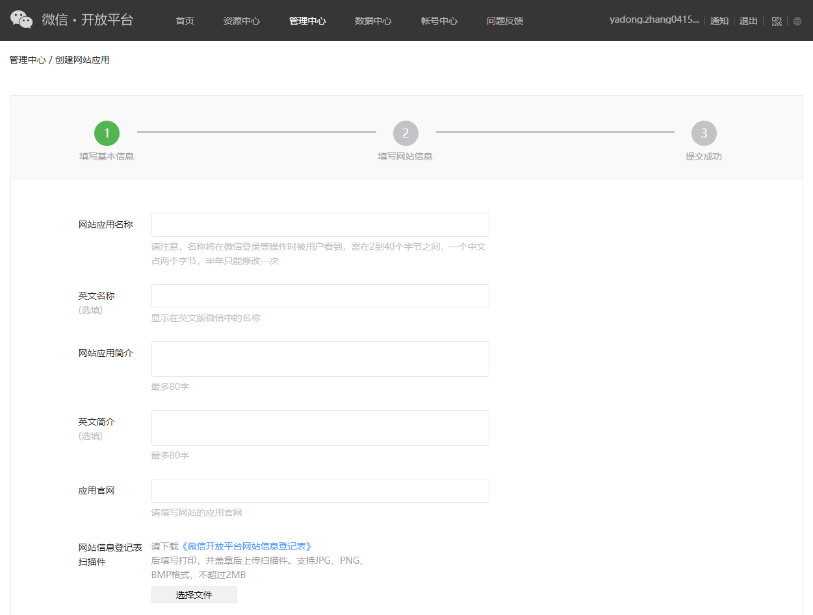
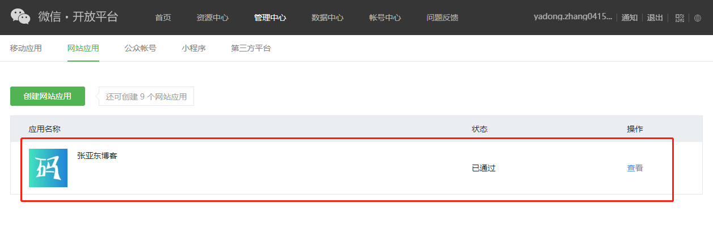
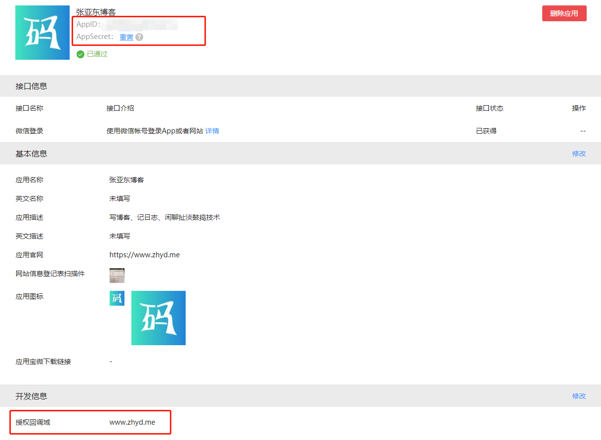
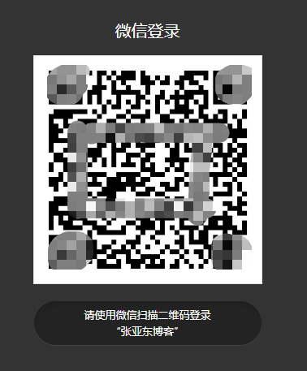
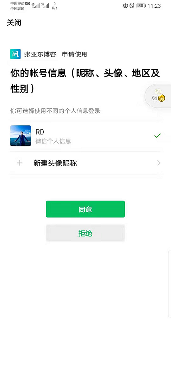

## 1. 申请应用

### 1.注册微信开放平台账号
[https://open.weixin.qq.com/](https://open.weixin.qq.com/)。如果已有则忽略该步骤，直接进入第二步。
### 2. 申请开发者资质认证

这儿需要重点说明的是， 微信开放平台创建应用，需要申请**开发者资质认证**


如上图：账号中心->开发者资质认证

但是微信**不支持**个人开发者认证，必须要企业信息才能提交认证。

对于个人开发者来说，我们提供三种解决方案：
- 用自己公司的信息做认证（请确保合法合规）
- 找朋友帮忙认证
- 去TB或者其他平台花钱找人认证，这种方式一般支持：短期租、长期认证

### 3.创建第三方应用

认证通过后切换到“网站应用”标签页，点击“创建网站应用”按钮





创建完成后，就能在“网站应用”列表中看到相关信息



点击“查看”进入应用详情，可以看到 “OAuth三大件”：`Client ID`、`Client Secret`和`Callback URL`。



**注意：**
- “授权回调域”填写对应域名即可。比如我想给我的博客 [https://www.zhyd.me](https://www.zhyd.me) 增加微信第三方登录，那么我在配回调地址时，就只需要填写 `www.zhyd.me`即可，实际我们自己开发程序时， 可以随便配置具体的回调地址，只要确保是在 `www.zhyd.me` 下的地址就行。本例中， 我在程序中配置的回调地址为：`https://www.zhyd.me/oauth/callback/wechat`
- 重要的事情说三遍：**一定要确保应用详情页的“接口信息”中的“微信登录”接口的状态为“已获得”！** **一定要确保应用详情页的“接口信息”中的“微信登录”接口的状态为“已获得”！** **一定要确保应用详情页的“接口信息”中的“微信登录”接口的状态为“已获得”！**否则一定会遇到这个问题：[“Scope参数错误或者Scope没有权限”是怎么回事？](../Q&A.md?id=_7scope参数错误或者scope没有权限是怎么回事？) 


## 2. 集成JustAuth


### 2.1 引入依赖

```xml
<dependency>
  <groupId>me.zhyd.oauth</groupId>
  <artifactId>JustAuth</artifactId>
  <version>${latest.version}</version>
</dependency>
```

`${latest.version}`表示当前最新的版本，可以在[这儿](https://github.com/justauth/JustAuth/releases)获取最新的版本信息。

### 2.2 创建Request

```java
AuthRequest authRequest = new AuthWeChatRequest(AuthConfig.builder()
                .clientId("Client ID")
                .clientSecret("Client Secret")
                .redirectUri("https://www.zhyd.me/oauth/callback/wechat")
                .build());
```

### 2.3 生成授权地址

我们可以直接使用以下方式生成第三方平台的授权链接：
```java
String authorizeUrl = authRequest.authorize();
```
这个链接我们可以直接后台重定向跳转，也可以返回到前端后，前端控制跳转。前端控制的好处就是，可以将第三方的授权页嵌入到iframe中，适配网站设计。


### 2.4 以上完整代码如下

```java
import me.zhyd.oauth.config.AuthConfig;
import me.zhyd.oauth.request.AuthWeChatRequest;
import me.zhyd.oauth.request.AuthRequest;
import me.zhyd.oauth.utils.AuthStateUtils;
import org.springframework.web.bind.annotation.PathVariable;
import org.springframework.web.bind.annotation.RequestMapping;
import org.springframework.web.bind.annotation.RestController;

import javax.servlet.http.HttpServletResponse;
import java.io.IOException;


@RestController
@RequestMapping("/oauth")
public class RestAuthController {

    @RequestMapping("/render")
    public void renderAuth(HttpServletResponse response) throws IOException {
        AuthRequest authRequest = getAuthRequest();
        response.sendRedirect(authRequest.authorize(AuthStateUtils.createState()));
    }

    @RequestMapping("/callback")
    public Object login(String code) {
        AuthRequest authRequest = getAuthRequest();
        return authRequest.login(code);
    }

    private AuthRequest getAuthRequest() {
        return new AuthWeChatRequest(AuthConfig.builder()
                .clientId("Client ID")
                .clientSecret("Client Secret")
                .redirectUri("https://www.zhyd.me/oauth/callback/wechat")
                .build());
    }
}
```
授权链接访问成功后会看到以下页面内容：


使用手机扫码后，将会进入确认授权页面



点击同意授权即可完成微信的oauth登录。

## 3. 授权结果

```json
{
	"code": 2000,
	"msg": null,
	"data": {
		"uuid": "xxxxxxx",
		"username": "RD",
		"nickname": "RD",
		"avatar": "http://thirdwx.qlogo.cn/mmopen/vi_32/DYAIOgq83ereNicKErbtBVnraCnzjGia2ZWPSkI9Ok4ScrmkdiacgPN6D5qeYBf3iba2lXknE7YaMMHHRrMW6Op8eQ/132",
		"blog": null,
		"company": null,
		"location": "中国-北京-",
		"email": null,
		"remark": null,
		"gender": "MALE",
		"source": "WECHAT",
		"token": {
			"accessToken": "28_Bzvt4UxxxxFElOxxxxgTqIJmSE5LxB2Az7stFqYVnFoIhL7RbevA0Urc",
			"expireIn": 7200,
			"refreshToken": "28_vtarjUxxxxfKh0Axxxxe_vy7E62hAYkMJ5M_JT4gMXM7r1kT_SeKAQz8Ojow",
			"uid": null,
			"openId": "xxxxxxx",
			"accessCode": null,
			"unionId": "xxxxxxx",
			"scope": null,
			"tokenType": null,
			"idToken": null,
			"macAlgorithm": null,
			"macKey": null,
			"code": null,
			"oauthToken": null,
			"oauthTokenSecret": null,
			"userId": null,
			"screenName": null,
			"oauthCallbackConfirmed": null
		}
	}
}
```