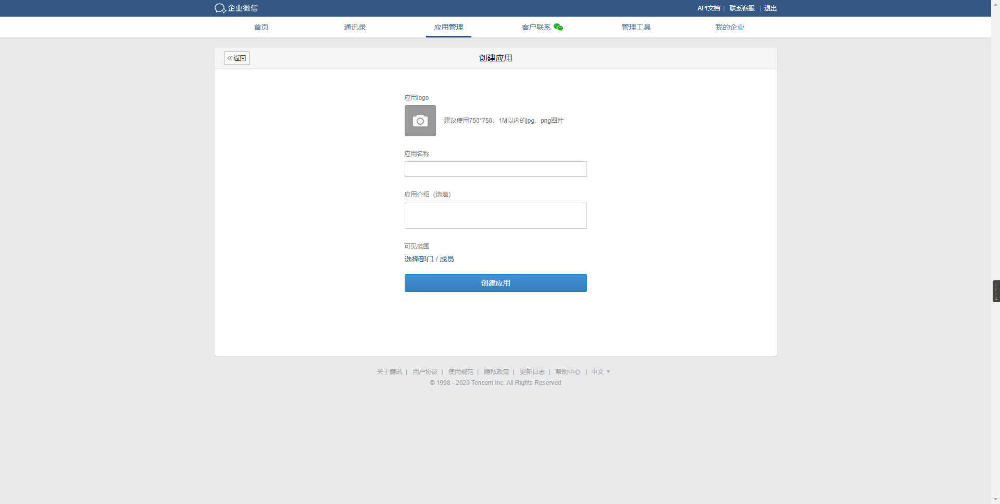
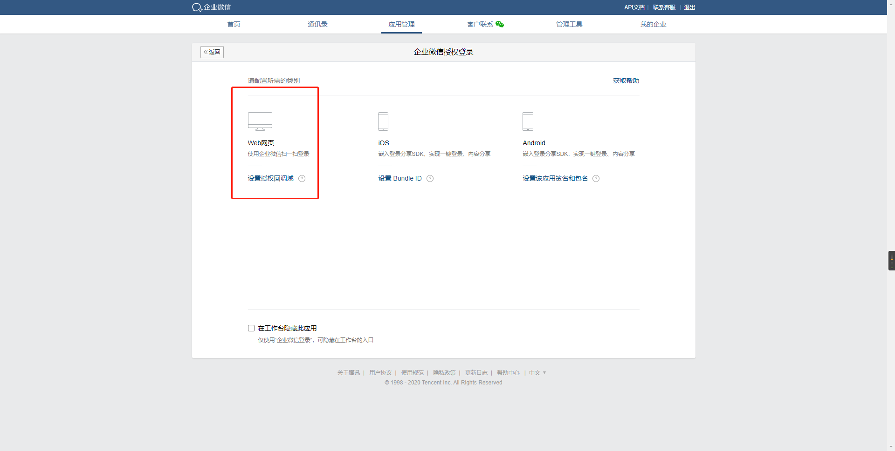
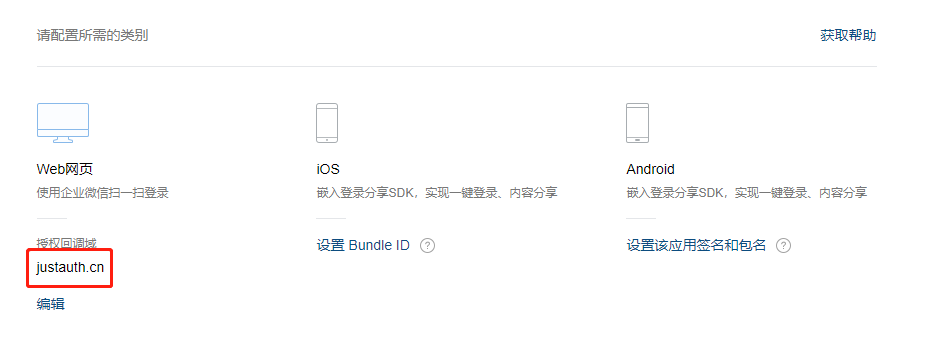
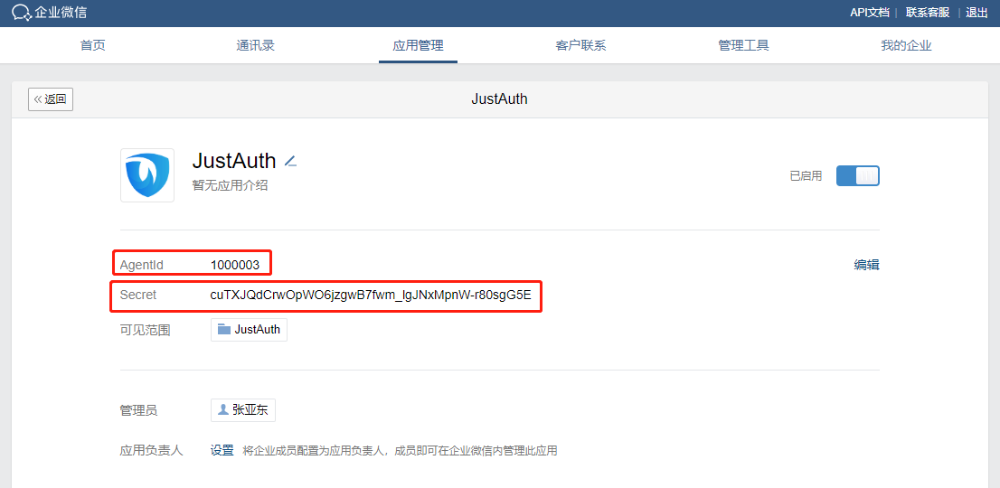
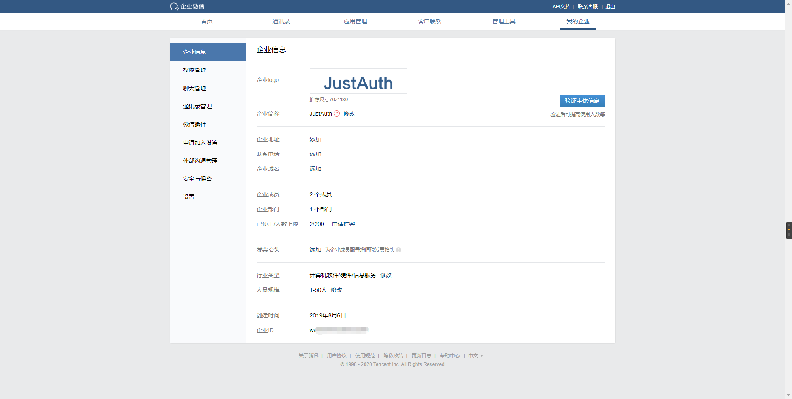
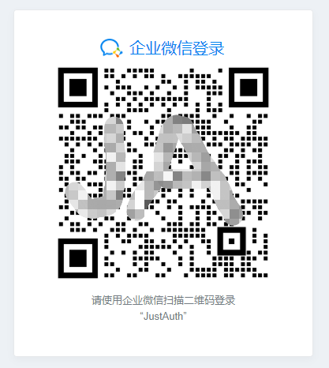
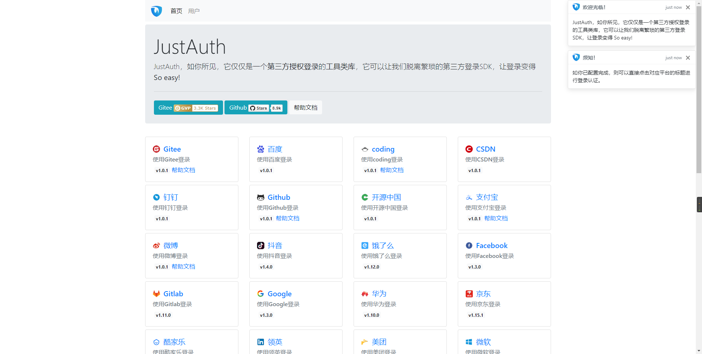
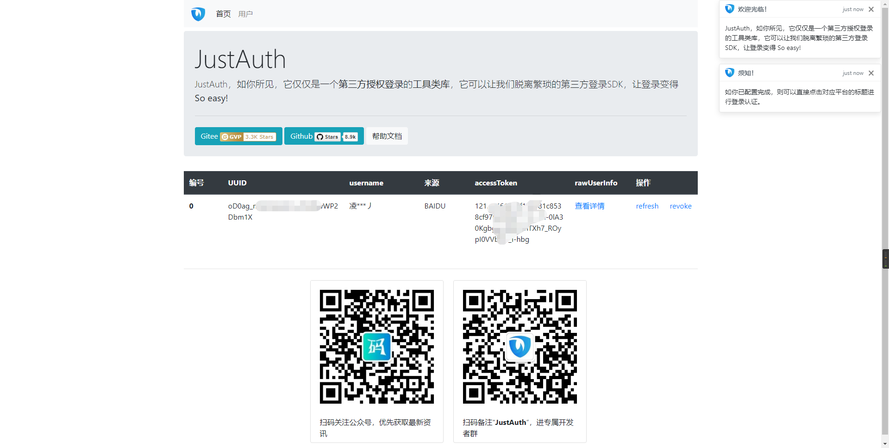

## 1. 申请应用

1. 登录微信企业版控制台：[控制台](https://work.weixin.qq.com/wework_admin/loginpage_wx?from=myhome_openApi)
    - 如果没有企业可以点击 “企业注册”注册企业后再登录控制台
2. 创建企业微信应用：导航栏 – 应用管理 – 自建 – 创建应用    
    
3. 设置企业微信授权登录
    1. 创建完应用之后，拖到应用最下方，选择“设置企业微信授权登录”    
        
    2. 设置“Web网页”应用的“授权回调域”    
        
    > 注意：这里 “授权回调域” 不需要指定 “前缀、后缀” 等信息，示例如下图，直接输入域名即可（文档中是直接用的`justauth.cn`主域名，如果开发者实际环境中用的是二级域名，比如`xxx.justauth.cn`，则此处直接配置`xxx.justauth.cn`即可）：    
    
    关于授权回调域存在疑问的童鞋请看这里：https://open.work.weixin.qq.com/api/doc#90000/90135/90988
4. 获取 OAuth 参数。
使用 JustAuth 进行企业微信登录需要 4 个参数信息：Client ID、Client Secret、Redirect Uri、Agent ID
    - Client Secret、Agent ID 这两个信息均在 应用管理 里可以查看   
        
    - Client ID 信息在 我的企业 中可以找到，该信息即 企业ID    
       
    - Redirect Uri 就是我们上面配置的“授权回调域”，按照微信企业平台的规范，我们只要保证在我们项目中使用的“回调地址”是在我们配置的“授权回调域”下的即可，
    比如本例中，在程序里直接配置“回调地址”为`http://justauth.cn/oauth/callback/wechat_enterprise`
    
记录以下三个信息：`Client ID`、`Client Secret`和`回调地址`，后面我们会用到。

**重要提示：“应用密钥”可保护你应用程序的安全，因此请确保其不会泄露！也不要与任何人共享你的“应用密钥”！！！**

## 2. 集成JustAuth

### 2.1 引入依赖

```xml
<dependency>
  <groupId>me.zhyd.oauth</groupId>
  <artifactId>JustAuth</artifactId>
  <version>${latest.version}</version>
</dependency>
```

`${latest.version}`表示当前最新的版本，可以在[这儿](https://github.com/justauth/JustAuth/releases)获取最新的版本信息。

### 2.2 创建Request

```java
AuthRequest authRequest = new AuthWeChatEnterpriseRequest(AuthConfig.builder()
                .clientId("Client ID")
                .clientSecret("Client Secret")
                .redirectUri("应用回调地址")
                .agentId("xxxx")
                .build());
```

### 2.3 生成授权地址

我们可以直接使用以下方式生成第三方平台的授权链接：
```java
String authorizeUrl = authRequest.authorize(AuthStateUtils.createState());
```
这个链接我们可以直接后台重定向跳转，也可以返回到前端后，前端控制跳转。前端控制的好处就是，可以将第三方的授权页嵌入到iframe中，适配网站设计。


### 2.4 以上完整代码如下

```java
import me.zhyd.oauth.config.AuthConfig;
import me.zhyd.oauth.request.AuthWeChatEnterpriseRequest;
import me.zhyd.oauth.model.AuthCallback;
import me.zhyd.oauth.request.AuthRequest;
import me.zhyd.oauth.utils.AuthStateUtils;
import org.springframework.web.bind.annotation.PathVariable;
import org.springframework.web.bind.annotation.RequestMapping;
import org.springframework.web.bind.annotation.RestController;

import javax.servlet.http.HttpServletResponse;
import java.io.IOException;


@RestController
@RequestMapping("/oauth")
public class RestAuthController {

    @RequestMapping("/render")
    public void renderAuth(HttpServletResponse response) throws IOException {
        AuthRequest authRequest = getAuthRequest();
        response.sendRedirect(authRequest.authorize(AuthStateUtils.createState()));
    }

    @RequestMapping("/callback")
    public Object login(AuthCallback callback) {
        AuthRequest authRequest = getAuthRequest();
        return authRequest.login(callback);
    }

    private AuthRequest getAuthRequest() {
        return new AuthWeChatEnterpriseRequest(AuthConfig.builder()
                .clientId("Client ID")
                .clientSecret("Client Secret")
                .redirectUri("回调地址")
                .agentId("xxxx")
                .build());
    }
}
```
授权链接访问成功后会看到以下页面内容：



点击“连接”即可完成百度的 OAuth 登录。

## 3. 授权结果

注：数据已脱敏

```json
{
    "code":2000,
    "data":{
        "avatar":"http://wework.qpic.cn/bizmail/0scp4g72tVgwftmkH4mjYrSsCfDZ3YQcgG1OggnS0zX6uQK0tFpS0w/0",
        "email":"",
        "gender":"MALE",
        "nickname":"",
        "rawUserInfo":{
            "errcode":0,
            "isleader":0,
            "gender":"1",
            "mobile":"xxx",
            "errmsg":"ok",
            "is_leader_in_dept":[
                0],
            "telephone":"",
            "avatar":"http://wework.qpic.cn/bizmail/0scp4g72tVgwftmkH4mjYrSsCfDZ3YQcgG1OggnS0zX6uQK0tFpS0w/0",
            "hide_mobile":0,
            "main_department":1,
            "userid":"xxx",
            "thumb_avatar":"http://wework.qpic.cn/bizmail/0scp4g72tVgwftmkH4mjYrSsCfDZ3YQcgG1OggnS0zX6uQK0tFpS0w/100",
            "enable":1,
            "name":"张亚东",
            "extattr":{
                "attrs":[
                ]
            },
            "qr_code":"https://open.work.weixin.qq.com/wwopen/userQRCode?vcode=vcd432f52d0ddbd39b",
            "alias":"",
            "position":"",
            "department":[
                1],
            "email":"",
            "status":1,
            "order":[
                0]
        },
        "source":"WECHAT_ENTERPRISE",
        "token":{
            "accessToken":"36etUbzYcBOxxP_9QlApFbvA4GGnvilxx3bHiimrlVrRxxTKvVfWPow",
            "code":"a80zqxW0a85zygHnqsio",
            "expireIn":7200
        },
        "username":"张亚东",
        "uuid":"xxxg"
    }
}
```

## 3. 推荐

官方推荐使用 [JustAuth-demo](https://github.com/justauth/JustAuth-demo) 示例项目进行测试。

使用步骤：
1. clone： [https://github.com/justauth/JustAuth-demo.git](https://github.com/justauth/JustAuth-demo.git)
2. 将上面申请的应用信息填入到`RestAuthController#getAuthRequest`方法的对应位置中：

3. 启动项目，访问 [http://localhost:8443](http://localhost:8443)
4. 选择对应的平台进行授权登录

5. 登录完成后，可以访问[http://localhost:8443/users](http://localhost:8443/users)查看已授权的用户


注：
1. 如果直接使用 JustAuth-demo 项目进行测试，那么在配置测试应用的“回调地址”时要严格按照以下格式配置：`http://localhost:8443/oauth/callback/{平台名}`
2. 平台名参考 `JustAuthPlatformInfo` 枚举类 `names`


