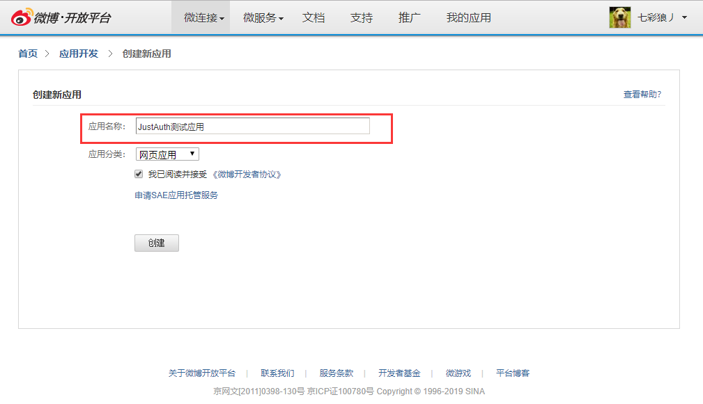
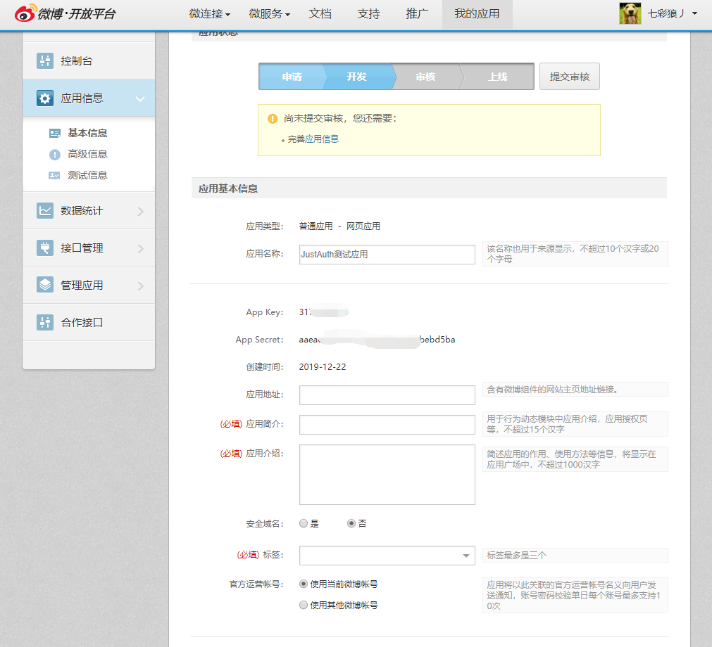
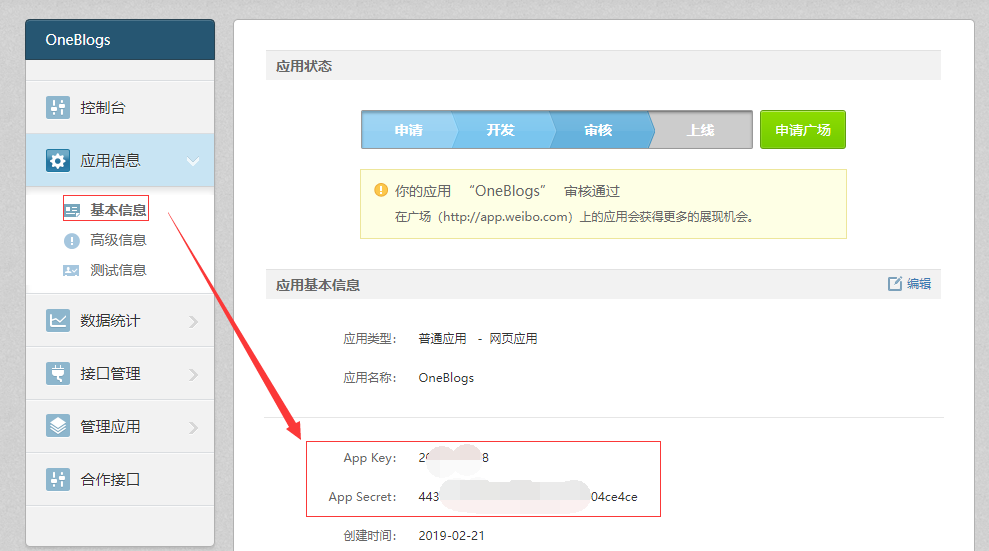
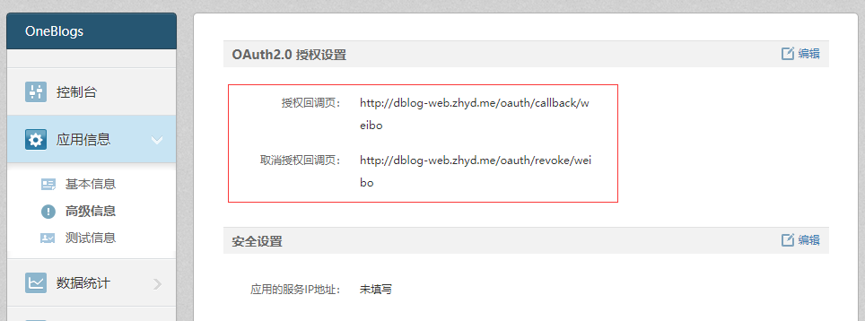
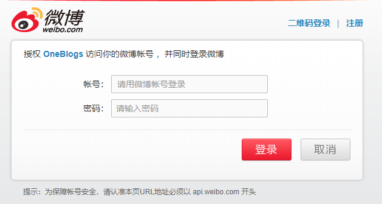

## 1. 申请应用

### 1.注册微博开放平台账号
https://open.weibo.com/apps。如果已有则忽略该步骤，直接进入第二步。
### 2.创建应用
通过顶部菜单栏的【微连接-网站接入】或者直接点击【[网站接入](https://open.weibo.com/connect)】进入网站接入界面


点击【立即接入】按钮进入创建应用页面，填入**应用名称**，**应用分类**选择默认的“网页应用”即可



创建完成后会自动跳转到应用信息页面，如下图，根据提示完善应用即可



注：全部填写完成后，需要提交审核。

提交审核完成后，将Oauth需要用到的数据copy下来（下面截图取自我已经审核通过的应用）：





微博平台的OAuth支持revoke操作，所以会有一个【取消授权回调页】配置。

## 2. 集成JustAuth


### 2.1 引入依赖

```xml
<dependency>
  <groupId>me.zhyd.oauth</groupId>
  <artifactId>JustAuth</artifactId>
  <version>${latest.version}</version>
</dependency>
```

`${latest.version}`表示当前最新的版本，可以在[这儿](https://github.com/justauth/JustAuth/releases)获取最新的版本信息。

### 2.2 创建Request

```java
AuthRequest authRequest = new AuthWeiboRequest(AuthConfig.builder()
                .clientId("App Key")
                .clientSecret("App Secret")
                .redirectUri("授权回调页")
                .build());
```

### 2.3 生成授权地址

我们可以直接使用以下方式生成第三方平台的授权链接：
```java
String authorizeUrl = authRequest.authorize(AuthStateUtils.createState());
```
这个链接我们可以直接后台重定向跳转，也可以返回到前端后，前端控制跳转。前端控制的好处就是，可以将第三方的授权页嵌入到iframe中，适配网站设计。


### 2.4 以上完整代码如下

```java
import me.zhyd.oauth.config.AuthConfig;
import me.zhyd.oauth.request.AuthWeiboRequest;
import me.zhyd.oauth.model.AuthCallback;
import me.zhyd.oauth.model.AuthToken;
import me.zhyd.oauth.request.AuthRequest;
import me.zhyd.oauth.utils.AuthStateUtils;
import org.springframework.web.bind.annotation.PathVariable;
import org.springframework.web.bind.annotation.RequestMapping;
import org.springframework.web.bind.annotation.RestController;

import javax.servlet.http.HttpServletResponse;
import java.io.IOException;


@RestController
@RequestMapping("/oauth")
public class RestAuthController {

    @RequestMapping("/render")
    public void renderAuth(HttpServletResponse response) throws IOException {
        AuthRequest authRequest = getAuthRequest();
        response.sendRedirect(authRequest.authorize(AuthStateUtils.createState()));
    }

    @RequestMapping("/callback")
    public Object login(AuthCallback callback) {
        AuthRequest authRequest = getAuthRequest();
        return authRequest.login(callback);
    }

    @RequestMapping("/revoke/{token}")
    public Object revokeAuth(@PathVariable("token") String token) throws IOException {
        AuthRequest authRequest = getAuthRequest();
        return authRequest.revoke(AuthToken.builder().accessToken(token).build());
    }

    private AuthRequest getAuthRequest() {
        return new AuthWeiboRequest(AuthConfig.builder()
               .clientId("App Key")
               .clientSecret("App Secret")
               .redirectUri("授权回调页")
                .build());
    }
}
```
授权链接访问成功后会看到以下页面内容：


网页登录或者手机扫码登录并授权第三方应用的登录请求后，将会获取到用户的信息

## 3. 授权结果

```json
{
	"code": 2000,
	"msg": null,
	"data": {
		"uuid": "xxxxxxx",
		"username": "七彩狼丿",
		"nickname": "七彩狼丿",
		"avatar": "https://tva3.sinaimg.cn/crop.0.0.1424.1424.50/649b9a6fjw8ezwz4inarqj213k13kwjh.jpg?KID=imgbed,tva&Expires=1577025808&ssig=Q7m4jDuwUt",
		"blog": "https://www.zhyd.me",
		"company": null,
		"location": "北京 朝阳区",
		"email": null,
		"remark": "长大了，不得不接受一些事实",
		"gender": "MALE",
		"source": "WEIBO",
		"token": {
			"accessToken": "2.xxxxxCNUC",
			"expireIn": 157679999,
			"refreshToken": null,
			"uid": "xxxxxxx",
			"openId": "xxxxxxx",
			"accessCode": null,
			"unionId": null,
			"scope": null,
			"tokenType": null,
			"idToken": null,
			"macAlgorithm": null,
			"macKey": null,
			"code": null,
			"oauthToken": null,
			"oauthTokenSecret": null,
			"userId": null,
			"screenName": null,
			"oauthCallbackConfirmed": null
		}
	}
}
```